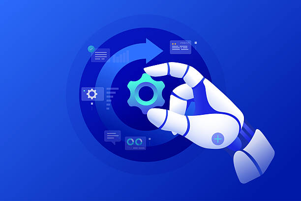

# Engineering Lifecyle Management with watsonx Orchestrate AI Agents

  

Ever thought of transforming your engineering lifecycle management with AI?

Imagine a world where requirement quality checks happen automatically, impact analysis traces dependencies in seconds, and test scripts write themselves based on organizational standards. With watsonx Orchestrate, this isn't just possible — it's practical.

This hands-on workshop guides you through building intelligent AI agents that integrate seamlessly with IBM Engineering Lifecycle Management (ELM) tools like DOORS Next. You'll create multi-agent workflows that automate tedious engineering tasks, improve quality, and accelerate delivery — all while maintaining full traceability and governance.

## What You'll Learn

* **Build multi-agent AI workflows** using watsonx Orchestrate to orchestrate complex engineering tasks with collaborating agents, tools, and knowledge bases
* **Integrate AI with ELM systems** by connecting watsonx Orchestrate to DOORS Next, Slack, and other enterprise tools through APIs, MCP servers, and custom integrations
* **Automate engineering processes** including requirement quality assessment, change impact analysis, conflict detection, stakeholder notifications, and AI-assisted test script authoring

## Use Case: ELM AI Assistant

This workshop consists of three progressive labs that build a comprehensive AI-powered assistant for engineering lifecycle management:

* **[Lab 1: Requirement Quality Assessment](lab1/README.md)** - Build an AI workflow that automatically evaluates requirement changes, assigns quality scores, identifies impacted artifacts, and generates actionable recommendations for improvement

* **[Lab 2: Requirement Change Impact Analysis](lab2-new/README.md)** - Create a multi-agent system that performs downstream impact analysis, detects requirement conflicts, and automatically notifies affected stakeholders via Slack

* **[Lab 3: Test Script Authoring and Validation](lab3/lab3-instructions.md)** - Develop an AI agent that generates standards-compliant test scripts from requirements, validates coverage completeness, and flags ambiguous or untestable language

## Getting Started

Before beginning the labs, you'll need to create an IBM Cloud account (IBMid) to access watsonx Orchestrate. Follow the instructions in the [IBM ID Creation prerequisite document](Prerequisite%20-%20IBM%20ID%20Creation.pdf) to set up your account.

Once your account is ready, navigate to the [labs directory](./) and select a lab to begin. Each lab includes detailed step-by-step instructions, architecture diagrams, and all necessary resources. We recommend completing the labs in order, as each builds upon concepts from the previous one, but this is not required.

Ready to revolutionize your engineering workflows? Let's get started!
