# Lab 1: Requirement Quality Assessment

## Table of Contents
- [1. Introduction](#introduction)
- [2. Accessing watsonx Orchestrate UI](#accessing-ui)
- [3. Building the Requirement Quality Assessment Solution](#building-requirement-quality-assessment)
    - [3.1 Requirement Quality Agent](#requirement-quality-agent)
    - [3.2 Requirement Recommendation Agent](#requirement-recommendation-agent)
    - [3.3 Requirement Quality Assessment Agent (Master Agent)](#requirement-quality-assessment-agent)
        - [3.3.1 Creating the master agent](#creating-from-scratch)
        - [3.3.2 Adding Tools](#adding-tools)
        - [3.3.3 Adding Collaborator Agents](#adding-collab-agents)
        - [3.3.4 Adding Behavior and Workflow Logic](#adding-behavior)
- [4. Testing the Requirement Quality Workflow](#testing-agent)
- [5. Deploying the Agent (Optional)](#deploying-agent)
- [6. Summary](#summary)

<details open id="introduction">
<summary><h2>1. Introduction</h2></summary>

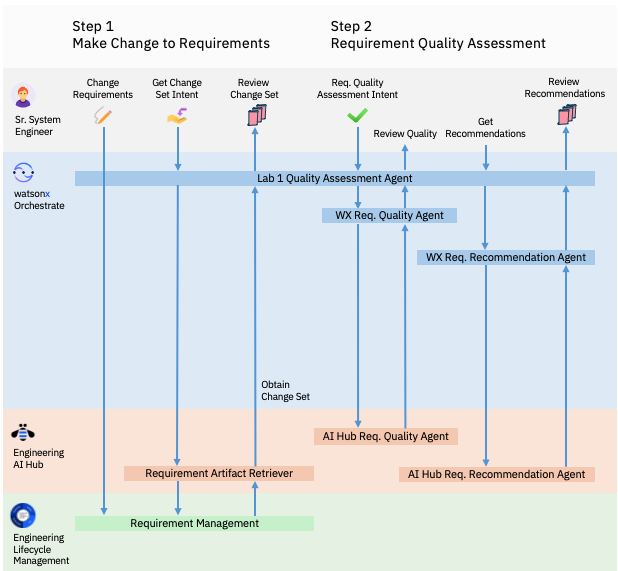

This lab focuses on automating **requirement quality assessment and improvement** using watsonx Orchestrate. The goal is to help system engineers make high-quality requirement changes by leveraging AI-driven evaluation, traceability, and recommendation workflows integrated with Engineering Lifecycle Management (ELM).

The scenario centers on a **System Engineer** updating existing requirements in DOORS Next (e.g., modifying timing thresholds or operating conditions). Ensuring these changes meet industry-standard language and quality guidelines is often manual and time-consuming.

In this lab, you will build an AI-powered workflow within watsonx Orchestrate that:

* Retrieves a **change set** from DOORS Next.
* Automatically evaluates modified requirements and assigns quality scores.
* Identifies impacted requirements for traceability.
* Generates actionable recommendations to improve low-scoring requirements.
* Presents improved requirement descriptions in a clear, review-ready format.

The solution uses collaborating agents for quality assessment, recommendation generation, and artifact retrieval, orchestrated seamlessly within watsonx.

By automating requirement quality checks, engineering teams can:

* Reduce manual review effort.
* Improve consistency with industry standards.
* Detect ambiguities early in the lifecycle.
* Accelerate requirement updates while maintaining governance and traceability.

[← Back to Table of contents](#table-of-contents) 
</details>


<details open id="accessing-ui">
<summary><h2>2. Accessing watsonx Orchestrate UI</h2></summary>

1. To access the watsonx Orchestrate console, go to the [Resources list on the IBM Cloud homepage](https://cloud.ibm.com/resources).
    

2. Expand the **AI / Machine Learning** section and select the resource that has **watsonx Orchestrate** in the Product column, as shown above. Then click **Launch watsonx Orchestrate**.

    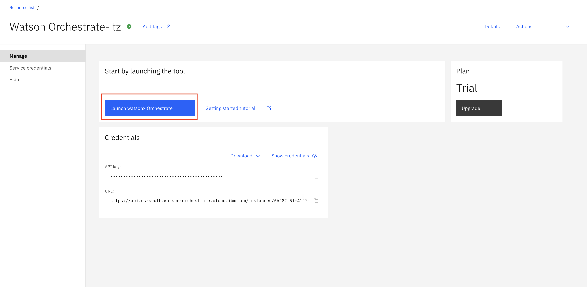

3. This opens the watsonx Orchestrate console.

    

4. Hit the hamburger menu on the top left corner and select **Build**

    

[← Back to Table of contents](#table-of-contents)

<details open id="building-requirement-quality-assessment">
<summary><h2>3. Building the Requirement Quality Assessment Solution</h2></summary>

In this section, we will walk through the steps to build the Requirement Quality Assessment solution using multiple collaborating agents in watsonx Orchestrate.

This solution consists of two child agents:

1. **Requirement Quality Agent:**  
   This agent is responsible for evaluating modified requirements against defined quality standards. It analyzes clarity, testability, ambiguity, and standards compliance, and assigns a quality score to each requirement.

2. **Requirement Recommendation Agent:**  
   This agent generates improved versions of low-scoring requirements. Based on the assessment results, it provides refined, standards-aligned wording that enhances precision and readability.

These child agents are coordinated by a Master agent — the **Requirement Quality Assessment Agent (Orchestrator)** — which manages the workflow, invokes the appropriate tools (such as retrieving requirement change sets), and routes tasks between the assessment and recommendation agents.

Let us begin by building the child agents first.

<details open id="requirement-quality-agent">
<summary><h3>3.1 Requirement Quality Agent</h3></summary>

1. Go to the **☰** hamburger menu from the top left and select the **Build** option. 
    

2. This will take us to the Agent Builder page, Click on the **Create Agent +** button as shown below
    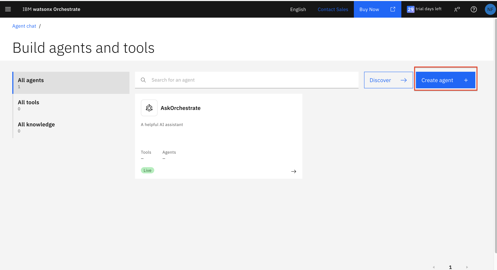

3. Since we will be creating an agent for this, select the **Create from scratch** option.
    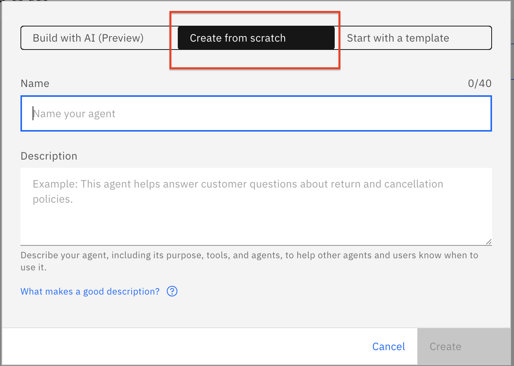

4. We will be building this agent from scratch, therefore enter the provided name and description to the agent.
    - **Name:** This describes the name of the Agent. Agents must have a unique name. Please prefix the agent name with **your initials followed by two digits** (e.g., `AB01`, `NF23`, etc.).

        Copy and paste the below format in the Name field, replacing the placeholder with your own initials and digits:
        ```
        <YOUR_INITIALS><TWO_DIGITS>-WX Requirement Quality Agent
        ```

    - **Description:** This describes what tasks the agent will be performing, this will be useful when we are building a multi agentic solution when agents need to discover suitable agents based on the task in hand. Copy and paste the below in the Description field.
        ```
        This agent scores requirements on a scale from 1 to 10 and gives reasons on how they can be improved.

        It takes in input in following format:
        { "requirements": [ { "id": <id>, "text": <text>, "artifact_type": "functional" } , { "id": <id>, "text": <text>, "artifact_type": "functional" }, ...] }

        It outputs:
        { "output": [ { "id": <id>, "score": <score>, "reasons": <reason> } , { "id": <id>, "score": <score>, "reasons": <reason> } , ...] }
        ```
        Once you are done entering the above details, click **Create**.
    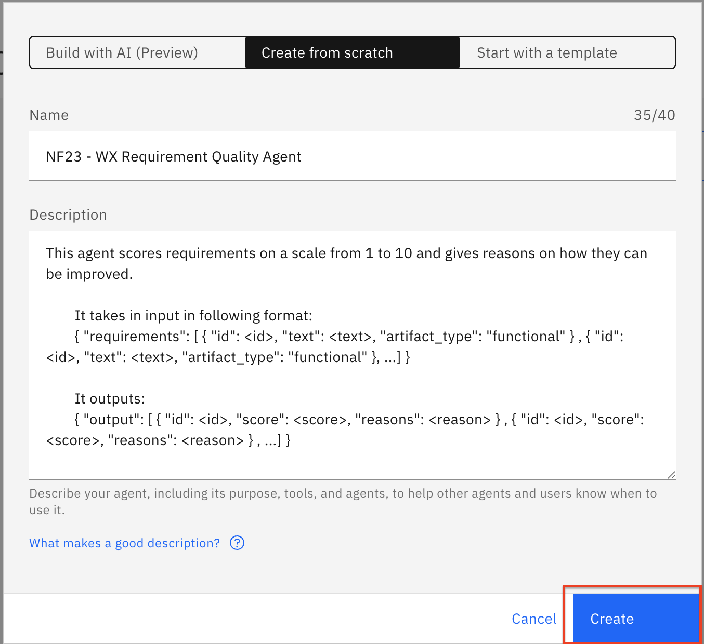

On the next screen, you can configure additional details about your agent.

5. You can select the **Large Language Model** the agent uses and the **style**. For this agent, select **GPT-OSS 120B** and the agent style as **React**.
    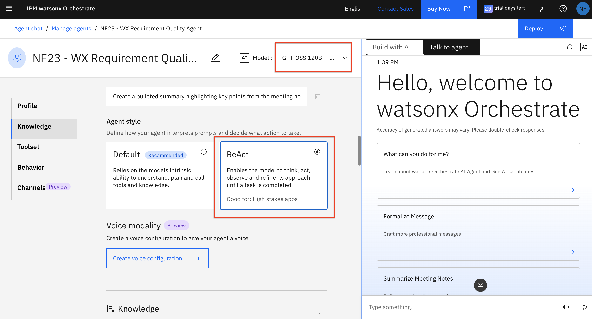

6. Click **Toolset** on the left menu or scroll down to the Toolset section. Under **Agents**, click **Add agent +**.
    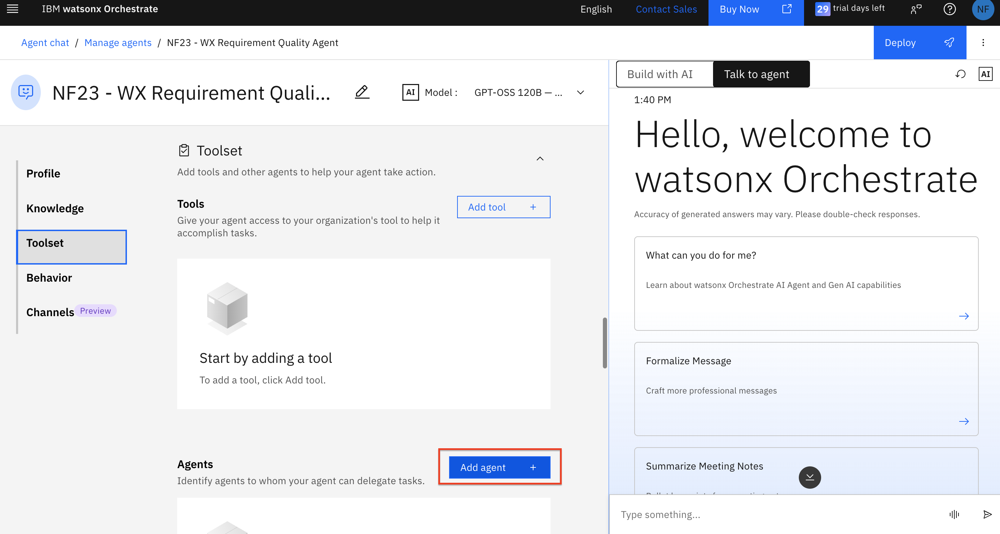

7. In the **Add a new agent** dialog box, select the **Import** option to register an external agent.
    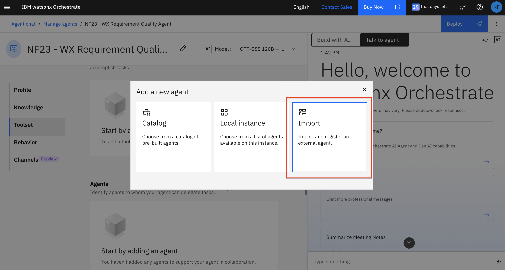

8. On the **Import agent** screen under *Choose agent type*, select **External agent**, then click **Next**.
    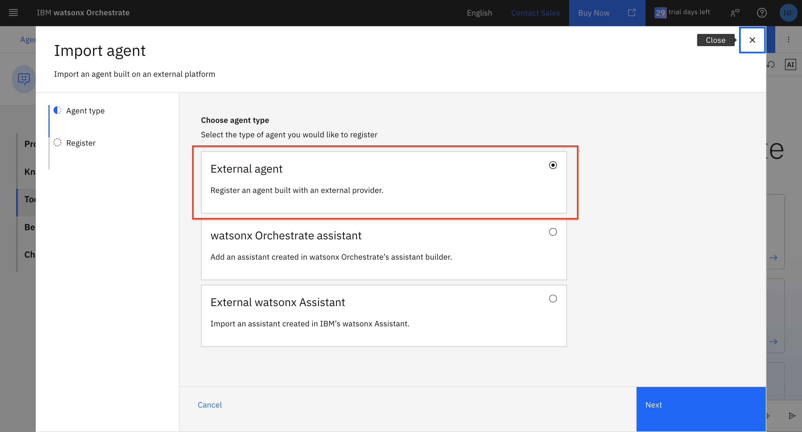

9. In the **Agent details** section, configure the external agent connection:
   - **External protocol:** Select *External agent via A2A standard*.
   - **A2A protocol version:** Select *0.3.0*.
   - **Authentication type:** Select *Bearer token* and provide the following token.
        ```
        Bearer abc
        ```
   - **External agent’s URL:** Enter the following Quality Agent endpoint URL.
        ```
        http://ai-hub-a2a.apps.itz-8zvb25.infra01-lb.dal14.techzone.ibm.com/quality-agent/
        ```
        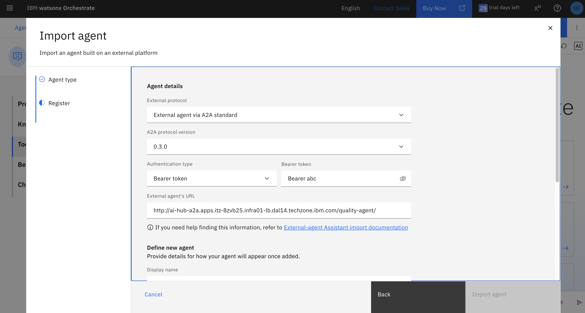

   - **Display name:** Agents must have a unique name. Prefix the name with **your initials followed by two digits** (e.g., `AB01`, `NF23`, etc.).

        Copy and paste the below format, replacing the placeholder with your own initials and digits:

        ```
        <YOUR_INITIALS><TWO_DIGITS>-AI Hub Requirement Quality Agent
        ```

   - **Description of agent capabilities:** Add the following description.
        ```
        This agent scores a requirement on a scale from 1-10 and returns reasons why it was scored that way.
        ```
   Keep the advanced settings as default, then click **Import agent** to complete the registration.
   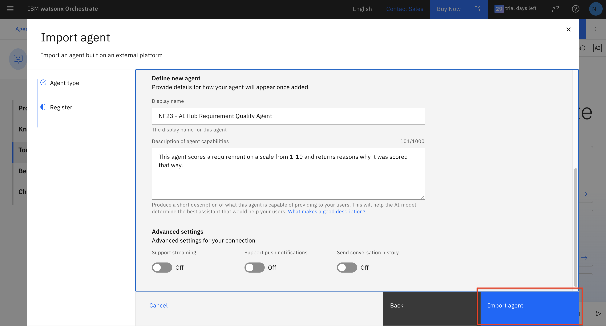

10. Now, we need to add behavior to the agent. Click Behavior on the left menu or scroll down to the Behavior section and enter the below provided content in the Instructions field.
    ```
    You are to take input in the following format:
    { "requirements": [ { "id": <id>, "text": <text>, "artifact_type": "functional" } , { "id": <id>, "text": <text>, "artifact_type": "functional" }, ...] }

    IMPORTANT: Do NOT add anything else to the JSON. The input to the AI Hub Requirement Quality Agent should be exactly the following. Do not add any wording like "Please score the following requirements..." or "Please rate the requirements.." or "Score the following requirements...", etc. This is extremely important, otherwise the rest of the process will fail. Triple check this step.

    You are then going to take this JSON and pass it to AI Hub Requirement Quality Agent. AI Hub Requirement Quality Agent will score the requirement on a scale from 1-10 and return reasons on how the score was calculated. 

    You are then going to take the output of AI Hub Requirement Quality Agent. IMPORTANT: all the information outputted should come straight from the ELM Quality Agent JSON output. Do NOT make up any of this information yourself. Output the following information.: 
    - ID: Id of the requirement
    - Score: Score of the requirement as calculated by the AI Hub Requirement Quality Agent. IMPORTANT: You should not fill this in yourself. It should come straight from the JSON outputted by the AI Hub Requirement Quality Agent.
    - Reason: This is a summary of the reasons by the requirement got the score it did. This should come straight from the output of the AI Hub Requirement Quality Agent. You shouldn't be filling in this yourself. This can be found in the JSON in the output of AI Hub Requirement Quality Agent. Please be verbose here. You should expand on terms like MISSING_LIMIT, IMPRECISE_VERB, etc.

    Present the output in the following format:

    { "output": [ { "id": <id>, "score": <score>, "reasons": <reason> } , { "id": <id>, "score": <score>, "reasons": <reason> } , ...] }
    ```
    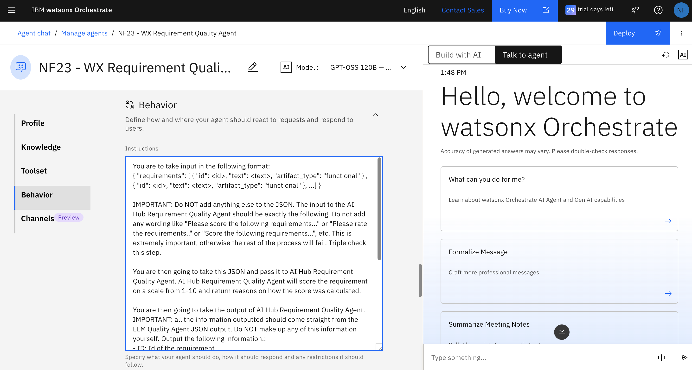

[← Back to Table of contents](#table-of-contents)
</details>
<details open id="requirement-recommendation-agent">
<summary><h3>3.2 Requirement Recommendation Agent</h3></summary>

1. Click on the **Manage Agents** option to go back to the agent builder page.
    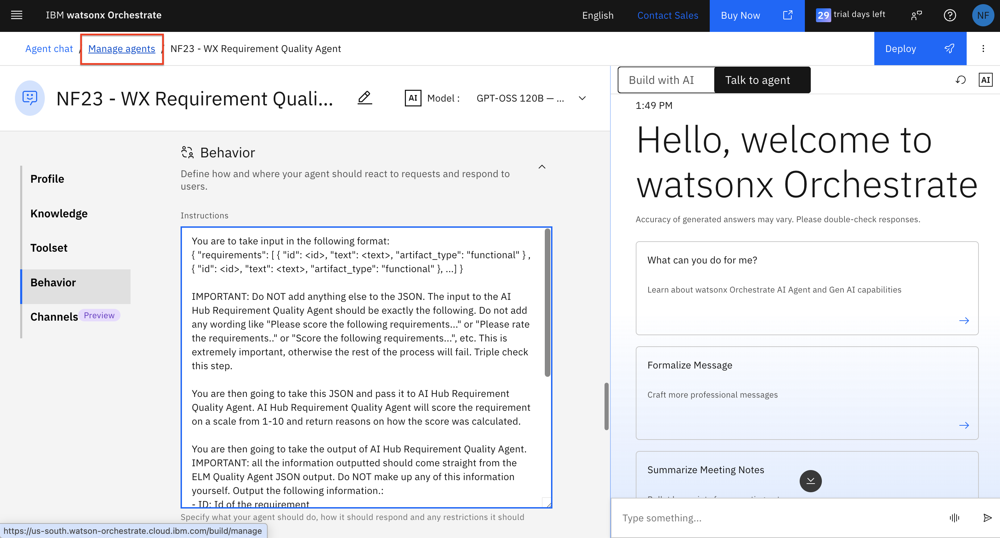

2. This will take us to the Agent Builder page, Click on the **Create Agent+** button as shown below
    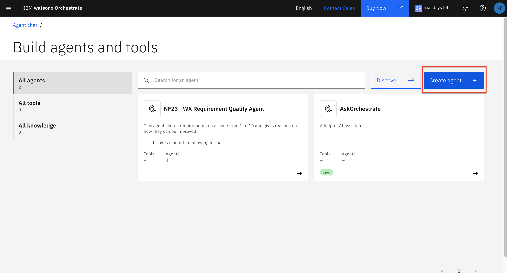

3. Like last time, select the **Create from scratch** option.
    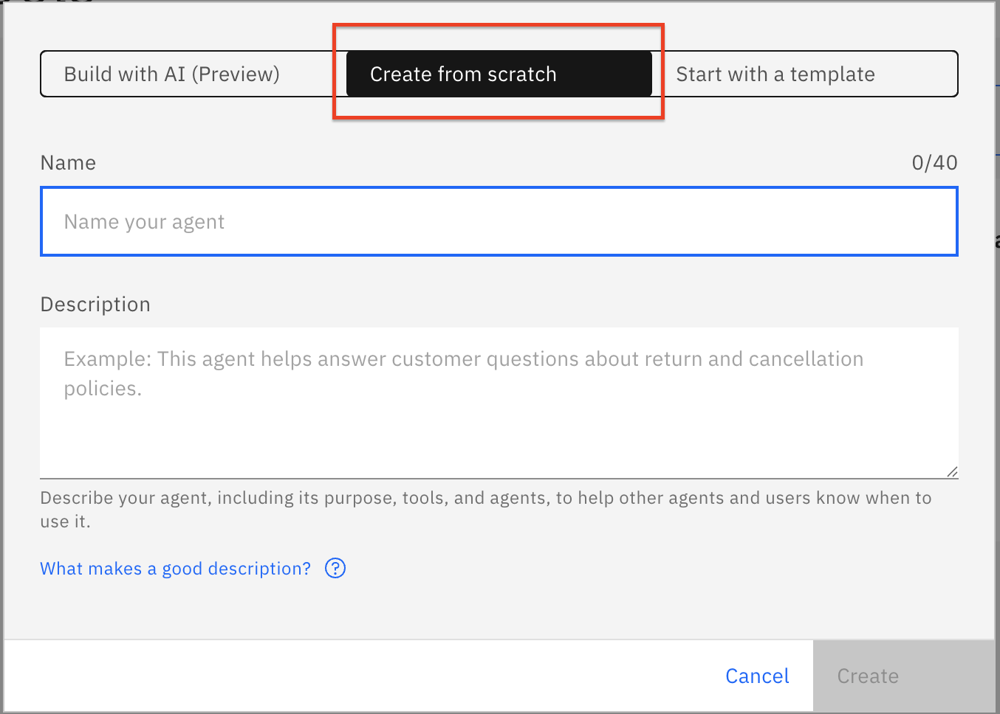

4. We will be building this agent from scratch, therefore enter the provided name and description to the agent.
    - **Name:** Copy and paste the below in the Name field. Agents must have a unique name. Please prefix the agent name with **your initials followed by two digits** (e.g., `AB01`, `NF23`, etc.).

        Copy and paste the below format in the Name field, replacing the placeholder with your own initials and digits:
        ```
        <YOUR_INITIALS><TWO_DIGITS>-WX Requirement Recommendation Agent
        ```
    - **Description:** Copy and paste the below in the Description field.
        ```
        This agent will give recommendations to poorly worded requirements.
        ```
        Once you are done entering the above details, click **Create**.
    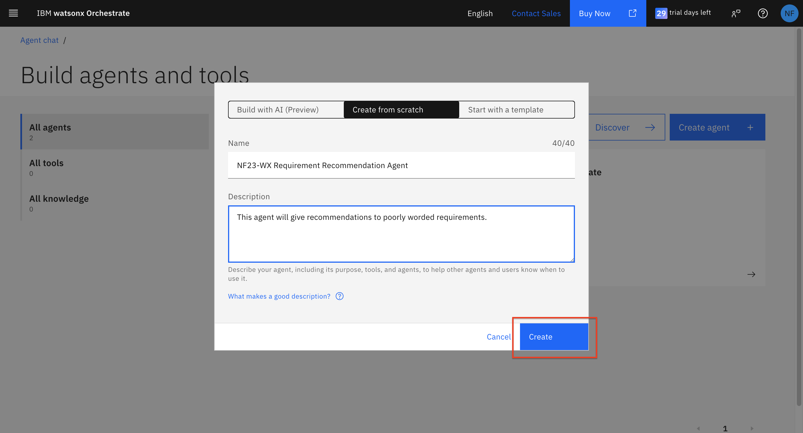

On the next screen, you can configure additional details about your agent.

5. You can select the **Large Language Model** the agent uses and the **style**. For this agent, select **GPT-OSS 120B** and the agent style as **Default**.
    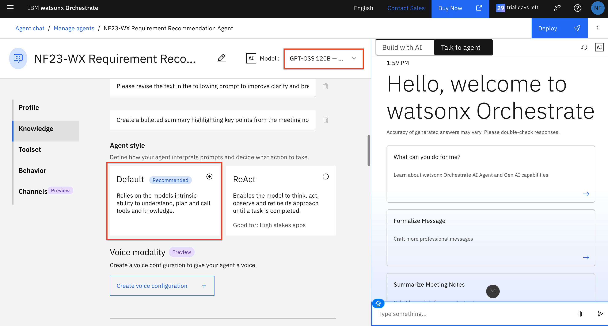

5. Click **Toolset** on the left menu or scroll down to the Toolset section. Under **Agents**, click **Add agent +**.
    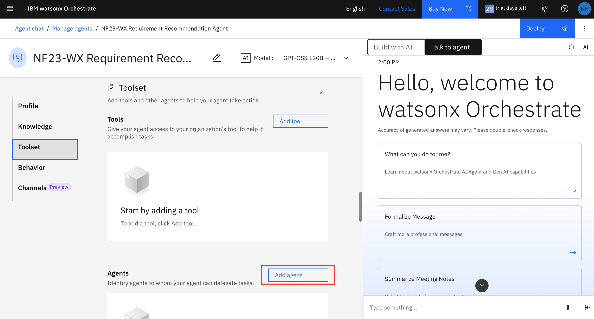

6. In the **Add a new agent** dialog box, select the **Import** option to register an external agent.
    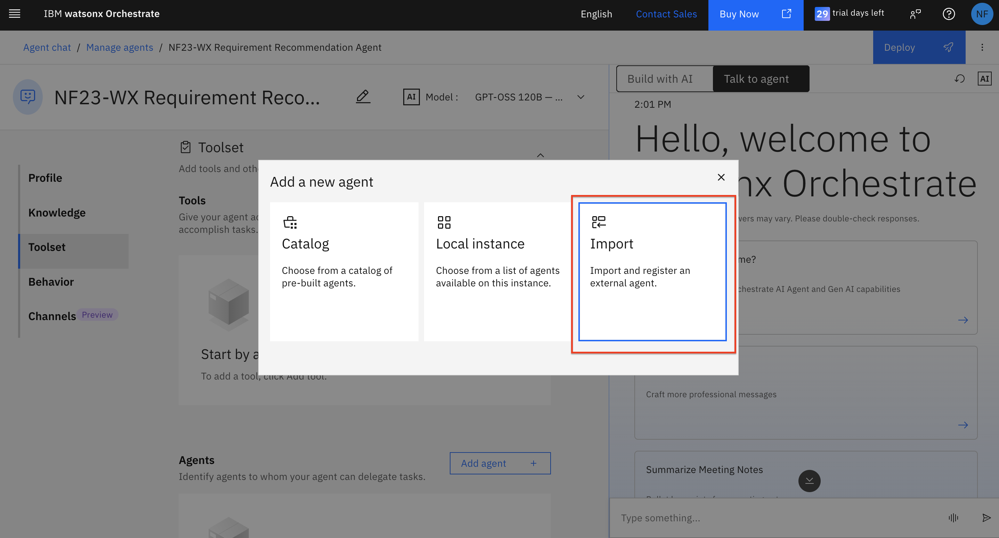

7. On the **Import agent** screen under *Choose agent type*, select **External agent**, then click **Next**.
    

8. In the **Agent details** section, configure the external agent connection:
   - **External protocol:** Select *External agent via A2A standard*.
   - **A2A protocol version:** Select *0.3.0*.
   - **Authentication type:** Select *Bearer token* and provide the following token.
        ```
        Bearer abc
        ```
   - **External agent’s URL:** Enter the following Quality Agent endpoint URL.
        ```
        http://ai-hub-a2a.apps.itz-8zvb25.infra01-lb.dal14.techzone.ibm.com/recommendation-agent/
        ```
    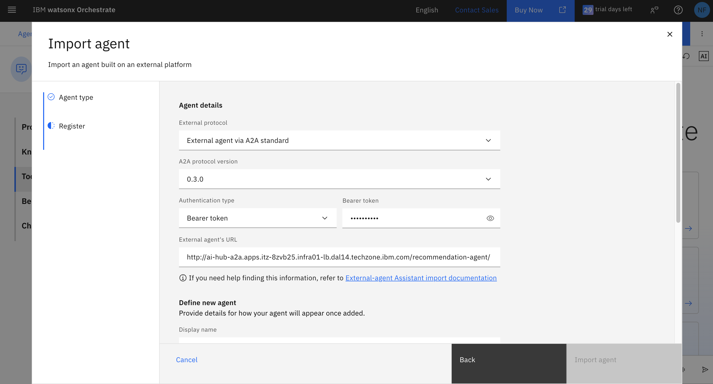

   - **Display name:** Agents must have a unique name. Prefix the name with **your initials followed by two digits** (e.g., `AB01`, `NF23`, etc.).

        Copy and paste the below format, replacing the placeholder with your own initials and digits:

        ```
        <YOUR_INITIALS><TWO_DIGITS>-AI Hub Recommendation Agent
        ```
   - **Description of agent capabilities:** Add the following description. 
        ```
        This agent will give recommendations on requirements.
        ```
   Keep the advanced settings as default, then click **Import agent** to complete the registration.
   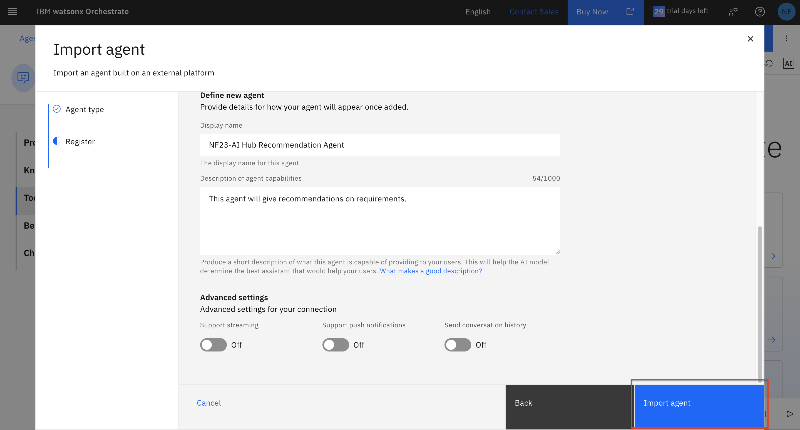

9. Now, we need to add behavior to the agent. Click Behavior on the left menu or scroll down to the Behavior section and enter the below provided content in the Instructions field.
    ```
    You are to take input in the following format:
    {"requirement":{"id": <id>, "text": <primary text>, "artifact_type": "functional"}}

    IMPORTANT: Do NOT add anything else to the JSON.  Do not add any wording like "Please rate the following requirements..." or "Please offer a recommendation..", etc. This is extremely important, otherwise the rest of the process will fail. Triple check this step. 

    You are then going to take this JSON and pass it to the AI Hub Requirement Recommendation Agent. The AI Hub Requirement Recommendation Agent will take the JSON and output a recommendation for the requirement. 

    You are then going to take the output of AI Hub Requirement Recommendation Agent. IMPORTANT: all the information outputted should come straight from the AI Hub Requirement Recommendation Agent JSON output. Do NOT make up any of this information yourself. Output the following information: 
    - ID: Id of the requirement
    - Recommendation: This should be the word-for-word verbatim recommendation given by the AI Hub Requirement Recommendation Agent. This should come straight from the output of the AI Hub Requirement Recommendation Agent. You shouldn't be filling in this yourself. This can be found in the JSON in the output of AI Hub Requirement Recommendation Agent. 

    Present the output in the following valid JSON format:

    { "output": { "id": <id>, "recommendation": <score>}}
    ```
    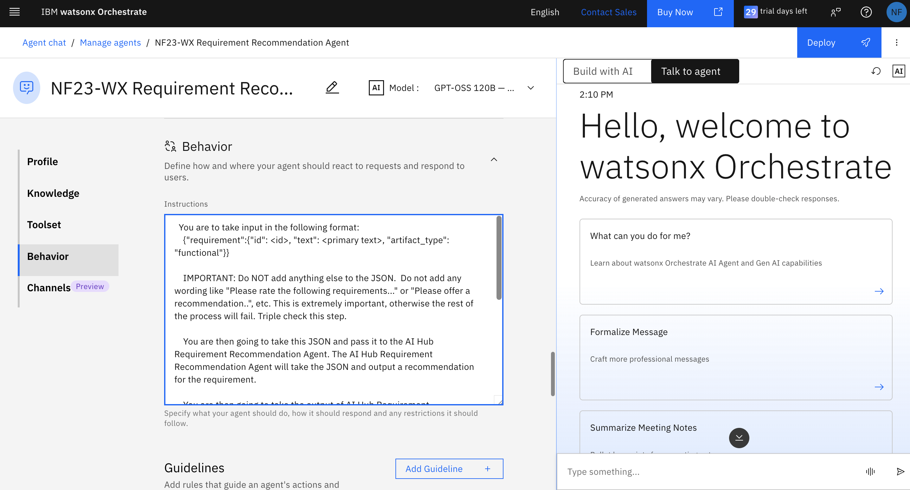

[← Back to Table of contents](#table-of-contents)
</details>

<details open id="requirement-quality-assessment-agent">
<summary><h3>3.3 Requirement Quality Assessment Agent (Master Agent)</h3></summary>

In this section we will be building the Master agent which will manage the above two built child agents

<details open id="creating-from-scratch">
<summary><h3>3.3.1 Creating the master agent</h3></summary>

1. Go to **Manage Agents** Tab and click on **Create Agent +**
    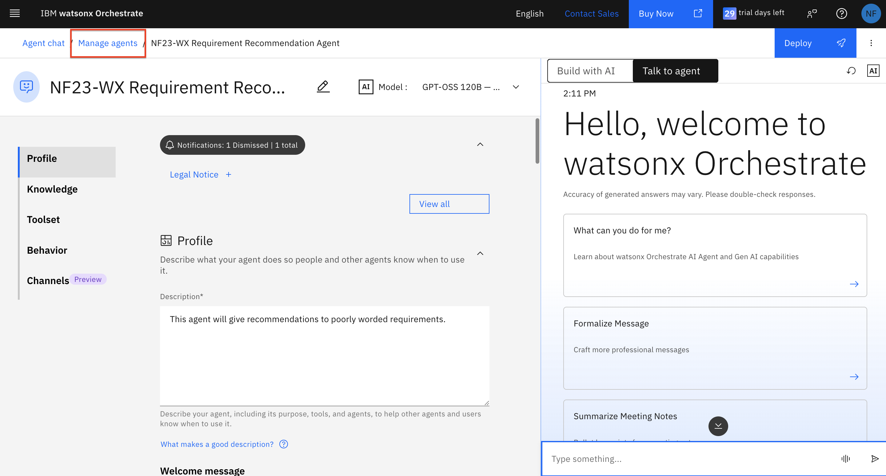

2. This will take us to the Agent Builder page, Click on the **Create Agent +** button as shown below
    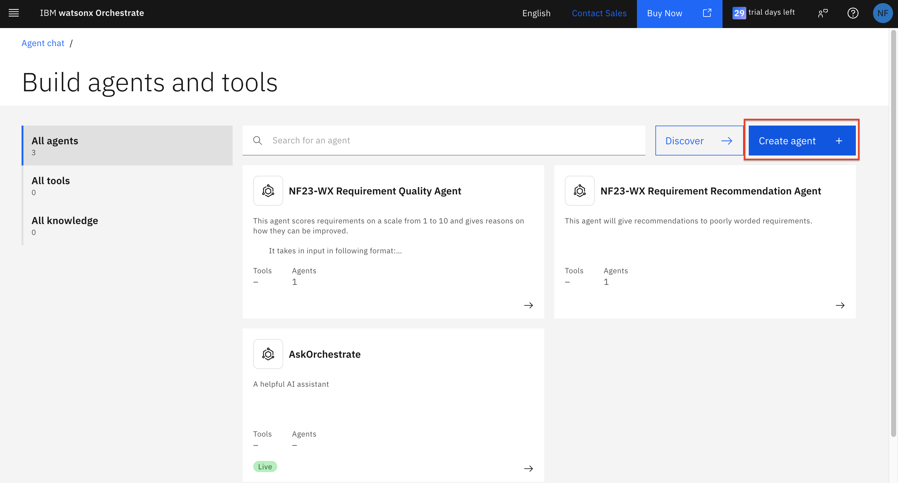

3. Like last time, select the **Create from scratch** option.
    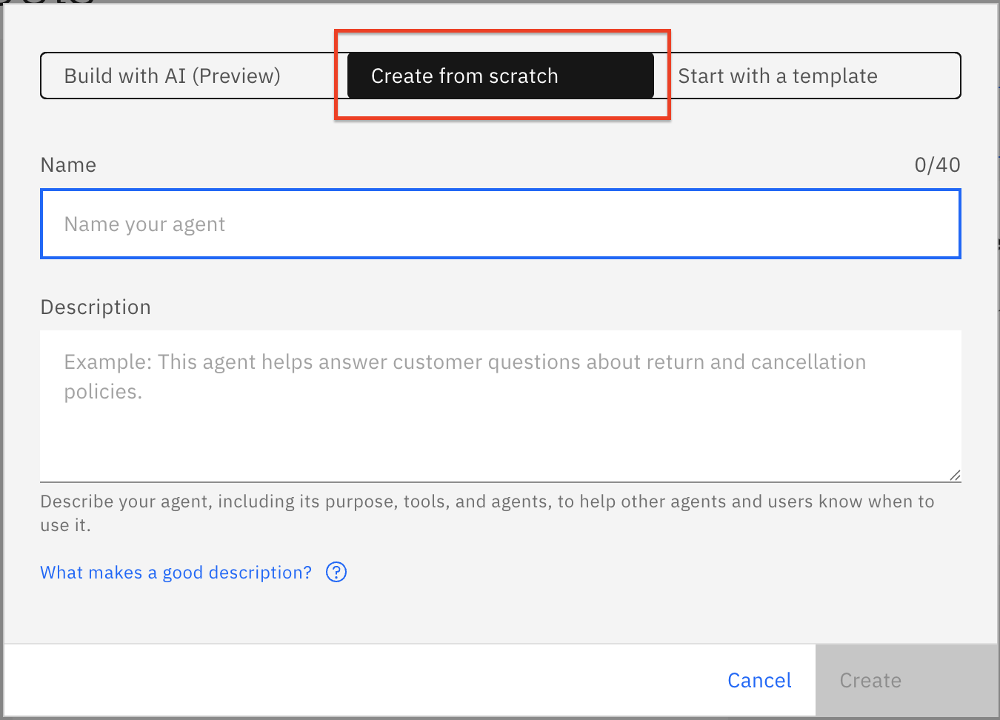

4. We will be building this agent from scratch, therefore enter the provided name and description to the agent.
    - **Name:** This describes the name of the Agent. Agents must have a unique name. Please prefix the agent name with **your initials followed by two digits** (e.g., `AB01`, `NF23`, etc.).

        Copy and paste the below format in the Name field, replacing the placeholder with your own initials and digits:
        ```
        <YOUR_INITIALS><TWO_DIGITS>-Lab 1 - Quality Assessment Agent
        ```
    - **Description:** Copy and paste the below in the Description field.
        ```
        This agent assesses requirement quality
        ```
        Once you are done entering the above details, click **Create**.
    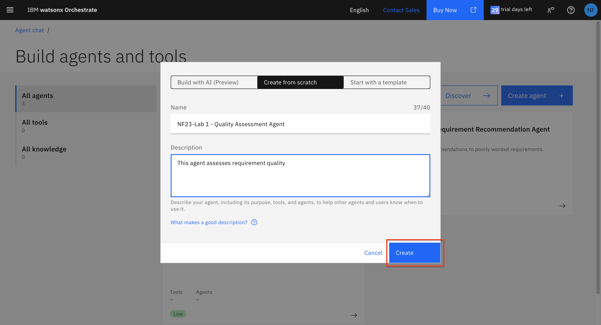

On the next screen, you can configure additional details about your agent.

5. You can select the **Large Language Model** the agent uses and the **style**. For this agent, select **GPT-OSS 120B** and the agent style as **React**.
    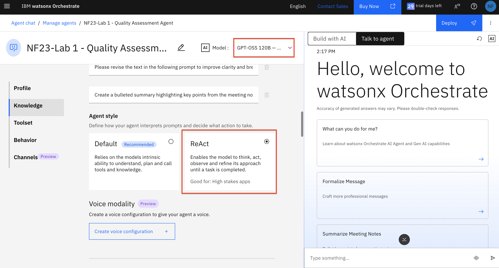

<details open id="adding-tools">
<summary><h3>3.3.2 Adding Tools</h3></summary>

1. Click **Toolset** on the left menu or scroll down to the Toolset section. Under **Tools**, click **Add tool +**.
    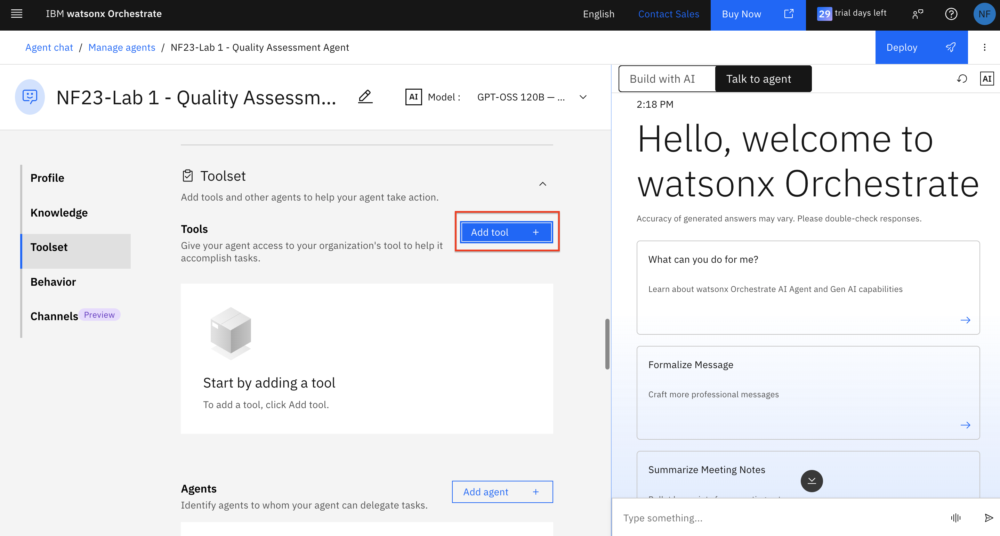

2. In the **Add a tool** dialog, select **MCP server** under the *Add from* section.
    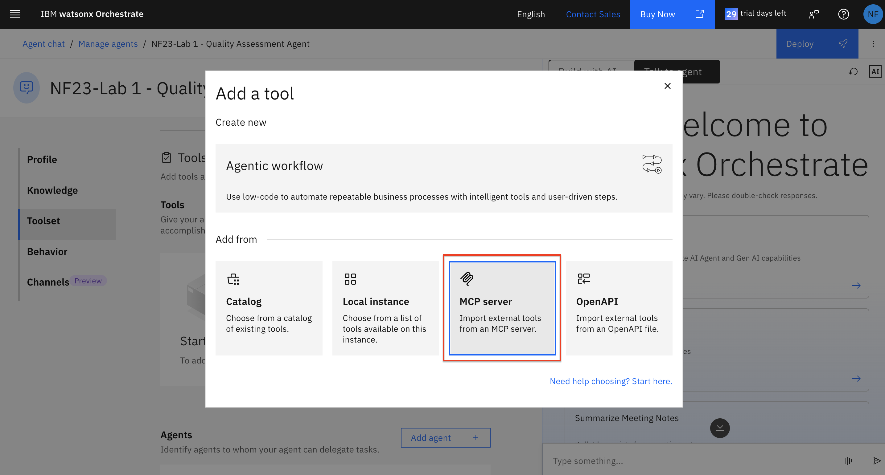

3. On the **Add tools and manage MCP servers** screen, click **Add MCP server +**.
    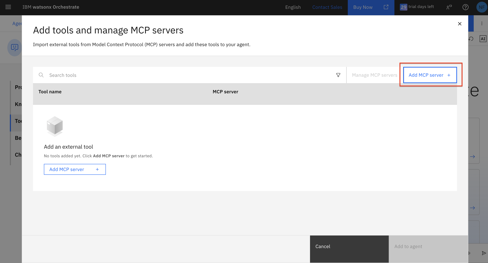

4. In the **Select an MCP server type** step, choose **Remote MCP server**, then click **Next**.
    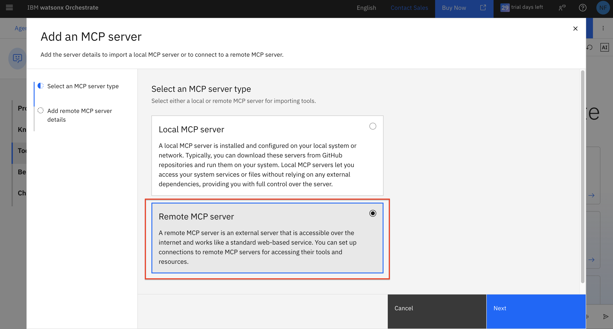

5. Under **Add remote MCP server details**, enter the following:
   - **Server name:** 
   ```
    <YOUR_INITIALS><TWO_DIGITS>-elm-ai-hub
    ```
   - **MCP server URL:** `http://ai-hub-mcp.apps.itz-8zvb25.infra01-lb.dal14.techzone.ibm.com/mcp`
   
   Leave all other fields as blank/default. After entering the details, click **Connect**.
   

6. Once the MCP server shows as ready, use the search bar to locate the required tools.  
   Search and select the following 2 tools:
   - **elm-ai-hub:get_requirement_details**
   - **elm-ai-hub:get_recently_modified_requirements**

   After selecting both tools, click **Add to agent**.
   

7. Verify that the selected tools now appear under the **Tools** section in the Toolset:
   - elm-ai-hub:get_requirement_details  
   - elm-ai-hub:get_recently_modified_requirements
   

[← Back to Table of contents](#table-of-contents)
</details>

<details open id="adding-collab-agents">
<summary><h3>3.3.3 Adding Collaborator Agents</h3></summary>

We will now be adding the above two agents we had previously created as collaborator agent to this master agent.

1. Scroll down to the toolset section or click on the **Toolset** option and click on **Add Agent +** button.
    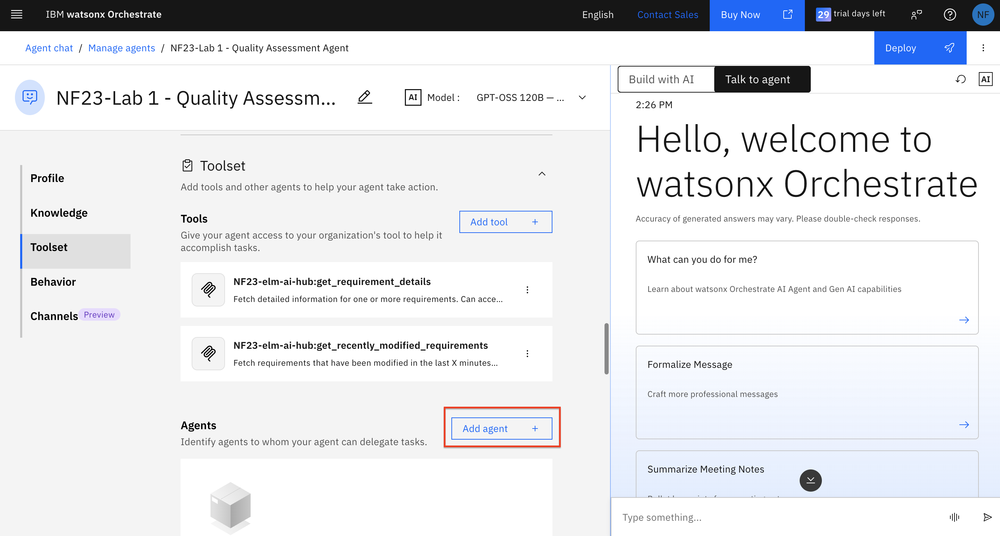

2. Choose the **Local Instance** option
    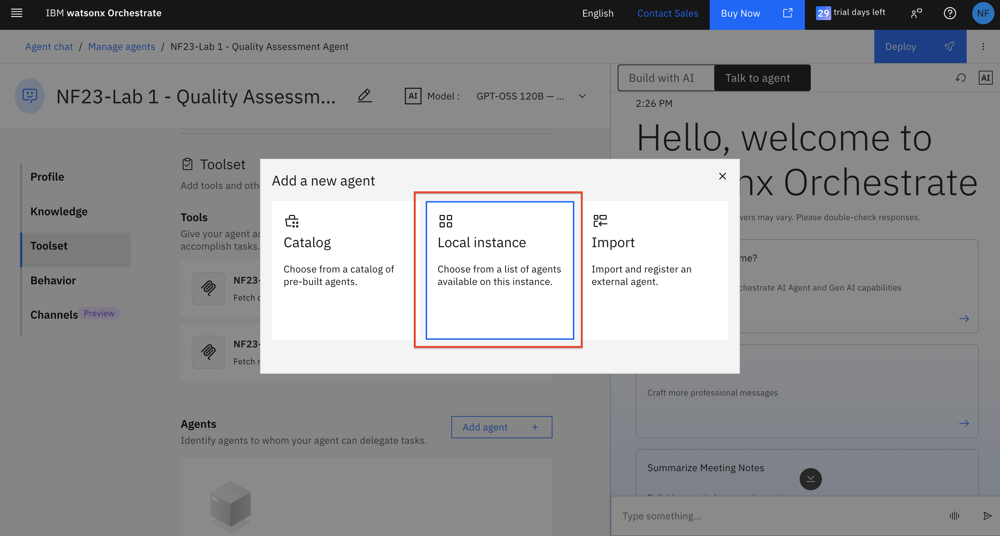

3. Select the two child agents we had created before
    - **WX Requirement Quality Agent**
    - **WX Requirement Recommendation Agent**

    Click on **Add to agent**
    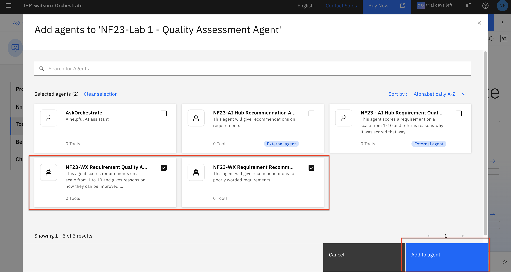

    You should now be able to see the two agents appear in the main agent page
    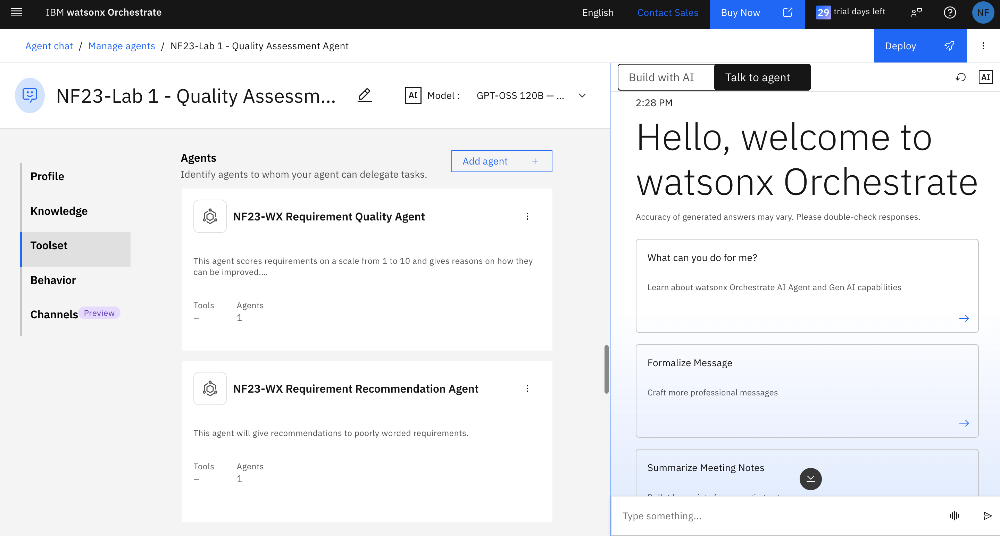

[← Back to Table of contents](#table-of-contents)
</details>

<details open id="adding-behavior">
<summary><h3>3.3.4 Adding Behavior to the Agent</h3></summary>

1. Click **Behavior** on the left menu or scroll down to the Behavior section and enter the below provided content in the **Instructions** field.

    ```
    IMPORTANT: Whenever a tool requires a project name parameter, the parameter is "Basic Cruise Control System (Requirements)"

    Follow the ensuing directions:
    1. The user will prompt you to give them the requirements that they have changed within the last X minutes. You are then going to call the tool get_recently_modified_requirements with minutes = X. From the output of the tool, observe and save the requirement ids that were returned.

    You are then to call elm-ai-ub:get_requirement_details with the the aforementioned ids. Present the requirements in a 2d table with the id, summary, and primary_text. IMPORTANT: The primary text will be formatted in HTML, we only want the text that is inside the <p> tags. When we refer to primary text in the future, we are only referring to the text inside the <p> tags.

    2. Now tell the user that for each requirement, we will score the requirement wording and offer potential feedback to improve the requirement. Ask the user if this is okay. Do not skip this confirmation step.

    3. IMPORTANT PRE-STEP TO STEP 4: You MUST convert the conversation to strictly in the following JSON format before sending to any agents:
    { "requirements": [ { "id": <id>, "text": <text>, "artifact_type": "functional" } , { "id": <id>, "text": <text>, "artifact_type": "functional" }, ...] }

    Do NOT show this information to the user. This step is only to prepare for step 4.

    4. Using ONLY the JSON created in Step 3, you are to invoke the WX Requirement Quality Agent. You MUST invoke this agent, do not try to score the details on your own.

    IMPORTANT: Do NOT add anything else to the JSON.  Do not add any wording like "Please score the following requirements..." or "Please rate the requirements..", etc. This is extremely important, otherwise the rest of the process will fail. Triple check this step. The input to the ELM Quality Agent should be exactly the following:

    { "requirements": [ { "id": <id>, "text": <text>, "artifact_type": "functional" } , { "id": <id>, "text": <text>, "artifact_type": "functional" }, ...] }

    After this agent is done, please come back to this current agent.

    5. Format the output of the WX Requirement Quality Agent and present the information in a readable table. You are include the following columns: id, score, and details. DO NOT ADD ANY OF YOUR OWN INFORMATION IN THIS STEP. THE OUTPUT SHOULD EXACTLY FROM THE OUTPUT OF THE WX Requirement Quality Agent.

    6. Now tell the user that you are going to improve the lower scoring requirements (defined as requirements than score < 10). Simply ask the user if this is okay. If they say yes, then proceed to the next step. If they say no, then end the flow.

    7. For each of the lower scoring requirements, you are to convert the requirement into the following valid JSON. Make sure the JSON is in this exact format.

    {"requirement":{"id": <id>, "text": <requirement primary text>, "artifact_type": "functional"}}

    IMPORTANT: Do NOT add anything else to the JSON.  Do not add any wording like "Please rate the following requirements..." or "Please offer a recommendation..", etc. This is extremely important, otherwise the rest of the process will fail. Triple check this step. The input to the WX Requirement Recommendation Agent should be exactly as the above.

    Now, pass each JSON created to the WX Requirement Recommendation Agent. For each requirement that was to be updated, you will receive a recommendation from the agent.

    Please present a table with the following the requirement id and final requirement primary text to the user. Use this rule: If the requirement id was low scoring and had to be rewritten by the WX Requirement Recommendation Agent, show the new recommendation in the table. If the requirement id was not low scoring, use the original primary text. The table should just have two columns, id and primary text.
    ```

    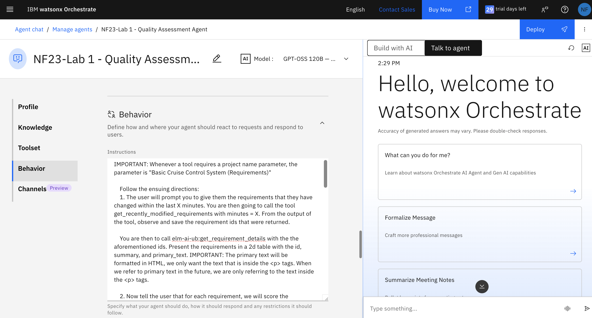

[← Back to Table of contents](#table-of-contents)
</details>

</details>

</details>


<details open id="testing-agent">
<summary><h2>4. Testing the agent</h2></summary>

Now we are all set to test our agent. To do so, start chatting in the **Preview** tab shown on the right side of the Agent Builder screen.

1. Enter the following:

    ```
    Give me the requirements that have changed in the last 60 minutes
    ```

   The agent will retrieve the recently modified requirements and display them in a table with **ID, Summary, and Primary Text**.

    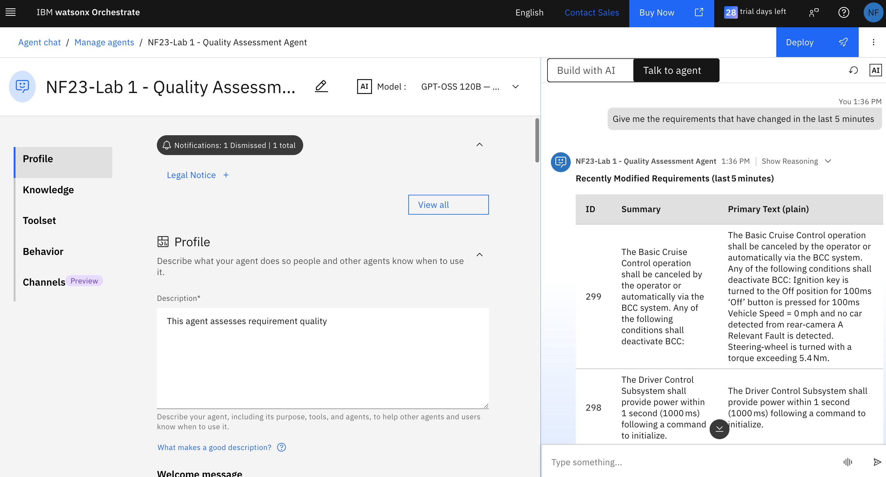

2. When the agent asks for confirmation to score the requirements, respond with:

    ```
    Yes
    ```

   The agent will invoke the **WX Req Quality Agent** and display a **Quality-Check Results** table with:
   - id  
   - score  
   - details  

   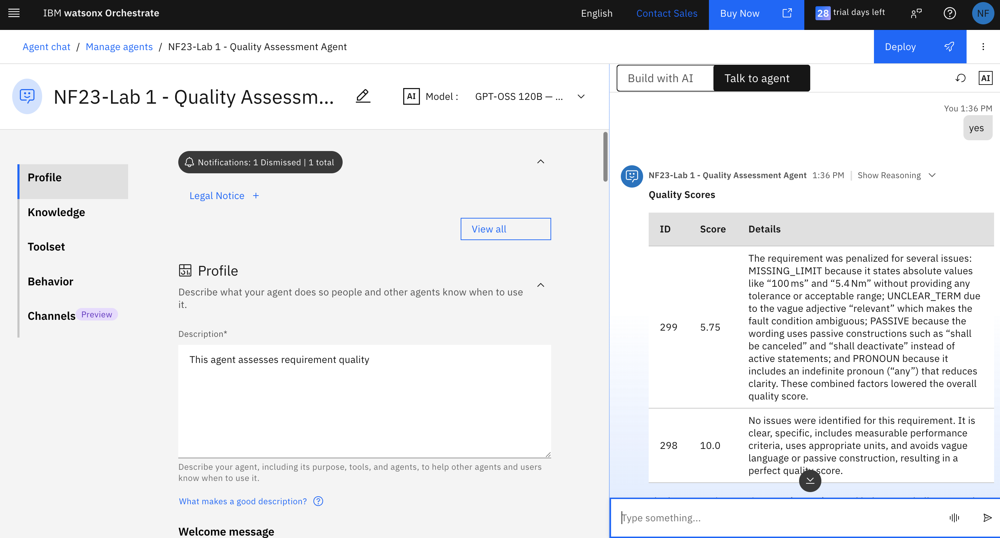

3. When prompted to improve the lower-scoring requirements, respond with:

    ```
    Yes
    ```

   The agent will invoke the **WX Requirement Recommendation Agent** and present a final **Revised Requirements** table showing:
   - id  
   - primary text  

    Then:
   - Requirements scoring 10 will retain their original wording.
   - Requirements scoring below 10 will display the improved recommendation.

   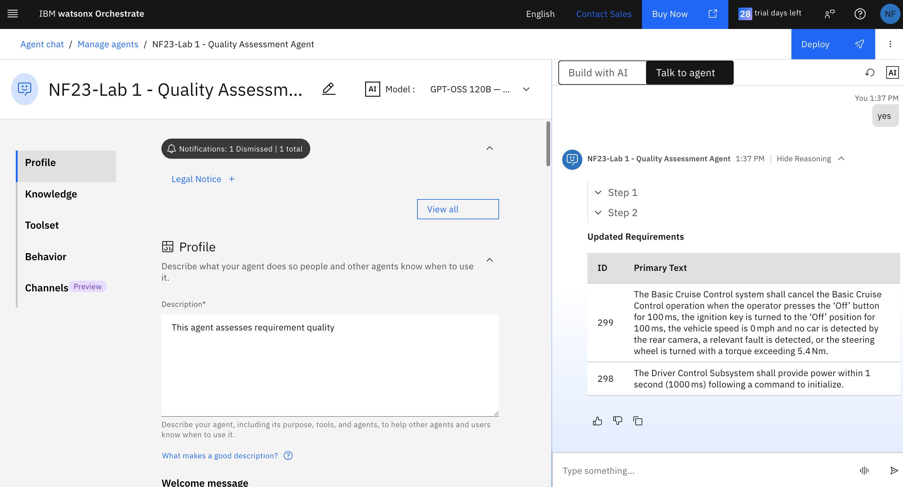

You have now successfully tested the complete end-to-end multi-agent workflow.

[← Back to Table of contents](#table-of-contents)
</details>


<details id="deploying-agent">
<summary><h2>5. Deploying the Agent (Optional)</h2></summary>

In this section, we will deploy the Requirement Quality Assessment along with the child agents created earlier. Deployment ensures that the agents are accessible through watsonx Orchestrate chat and ready to handle real-time queries.
    
To deploy the agent, follow the below steps:

1. Turn on the toggle button for Home page so that your agent shows up in the watsonx Orchestrate Chat home page, once deployed.
    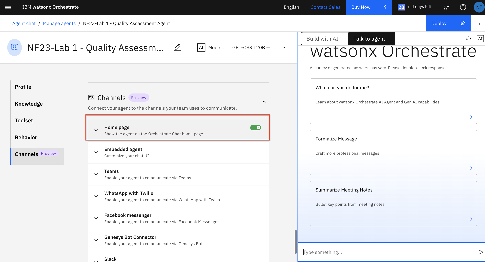

2. Click the **Deploy** button in the top-right corner to deploy your agent.
    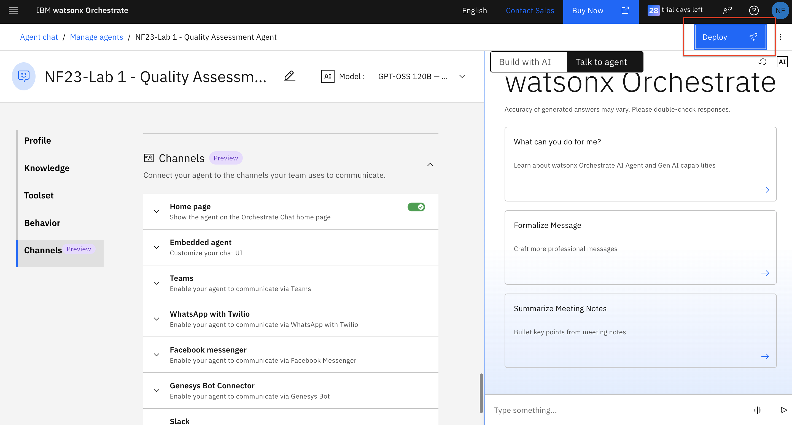

3. Click the **Deploy** button in the bottom-right corner of Pre-deployment summary page.


    It may take a few seconds to complete the deployement process
    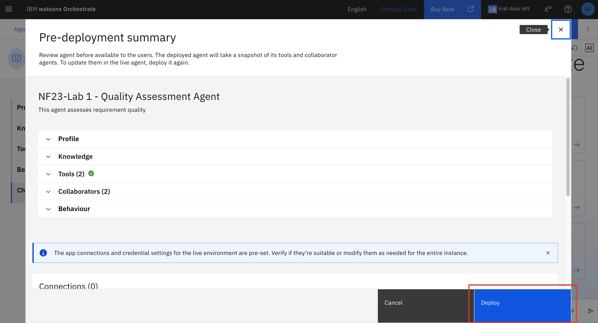

4. To test the agent from the AI Chat window, click on the **☰** hamburger menu in the top left corner and then click on Chat.
    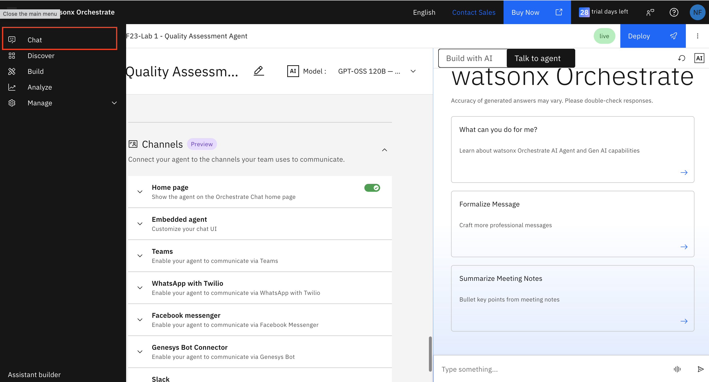

5. Make sure your **Lab 1 - Quality Asessment Agent** is selected in the dropdown. You can now test your agent.
    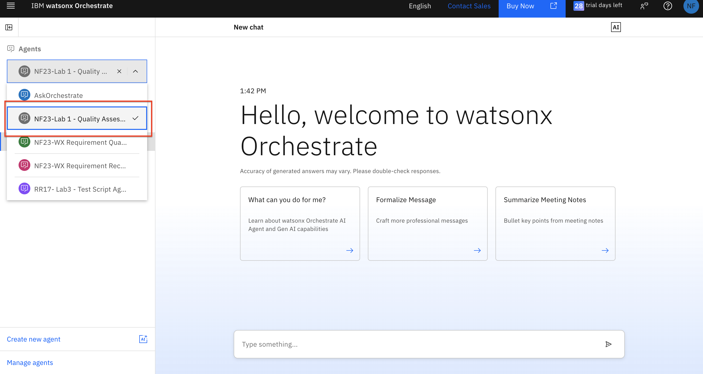

[← Back to Table of contents](#table-of-contents) 

</details>


<details open id="summary">
<summary><h2>6. Summary</h2></summary>

In this lab, we successfully built an AI-powered requirement quality solution in watsonx Orchestrate designed to automate the evaluation and improvement of system requirements. The agent workflow was configured to retrieve requirement change sets from Engineering Lifecycle Management (ELM), assess requirement quality, and generate actionable recommendations to improve clarity, consistency, and standards compliance.

Throughout the lab, we accomplished the following key learning objectives:

* Created a master orchestration agent to manage the end-to-end requirement quality workflow.
* Integrated multiple collaborator agents:
  * **Requirement Quality Assessment Agent** to score and evaluate modified requirements.
  * **Requirement Recommendation Agent** to generate improved requirement descriptions.
* Added behavior instructions to enable intelligent coordination between agents.
* Tested the solution’s ability to:
  * Retrieve recently modified requirements.
  * Assign quality scores based on requirement best practices.
  * Suggest improved wording for low-scoring requirements.
* Optionally deployed the agent for real-time interaction through the watsonx Orchestrate interface.

By completing this lab, you have gained hands-on experience in building multi-agent solutions that embed AI-driven quality intelligence into engineering workflows, reduce manual review effort, and improve requirement clarity and compliance early in the lifecycle.

[← Back to Table of contents](#table-of-contents) | [← Back to Main Page](../../README.md) | [Next: Lab 2 - Impact Analysis →](../lab2/README.md)
</details>
