## Table of Contents
- [1. Introduction](#introduction)
- [2. Accessing watsonx Orchestrate UI](#accessing-ui)
- [3. Building the Test Script Authoring and Validation Solution](#test-script-solution)
    - [3.1 Test Script Agent](#test-script-agent)
        - [3.1.1 Adding Tools](#adding-tools)
        - [3.1.2 Adding Workflows](#adding-workflows)
- [4. Testing the Test Script Workflow](#testing-agent)
- [5. Deploying the Agent (Optional)](#deploying-agent)
- [6. Summary](#summary)

<details open id="introduction">
<summary><h2>1. Introduction</h2></summary>

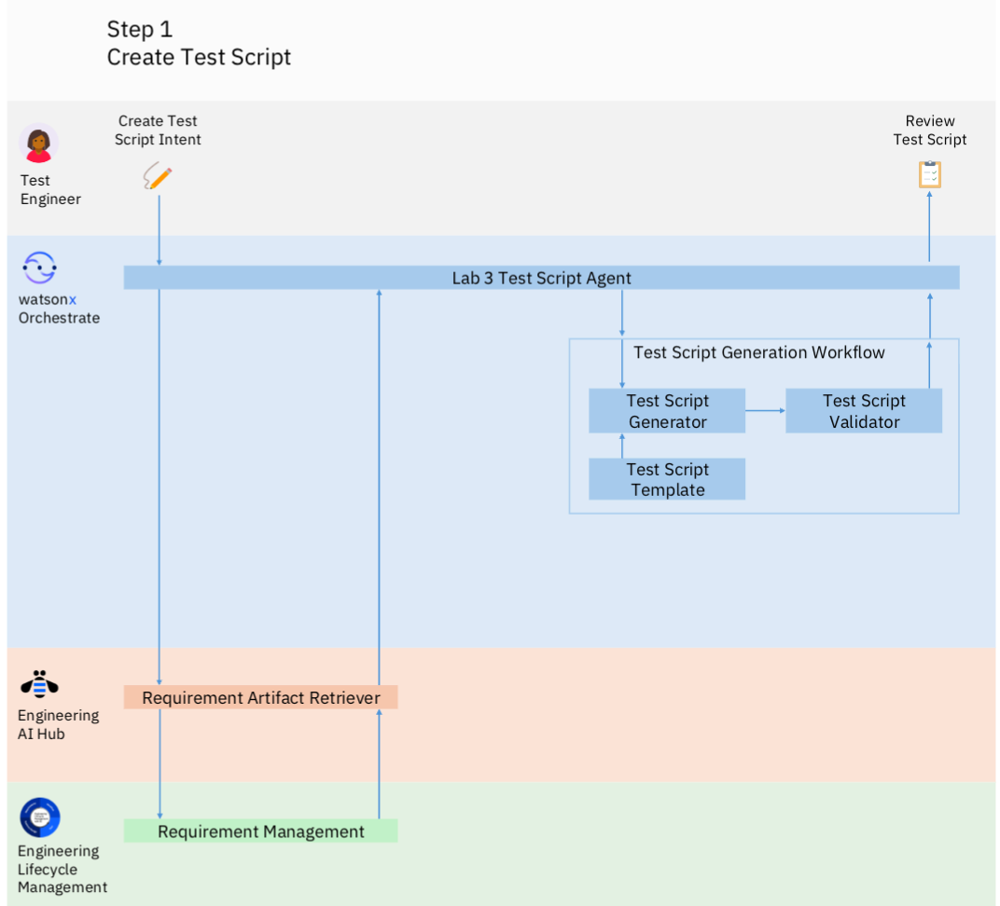

This lab focuses on **AI-assisted test script authoring and validation** using watsonx Orchestrate. The goal is to help test engineers rapidly create high-quality, standards-compliant test scripts by leveraging AI to reuse templates, interpret requirements, and validate completeness against acceptance criteria.

The scenario centers on a **Test Engineer** who needs to create a test script for a requirement in Engineering Lifecycle Management (ELM). Manually authoring and validating these scripts is often time-consuming and inconsistent, risking gaps in coverage or misalignment with organizational standards.

In this lab, you will build an AI-powered workflow within watsonx Orchestrate that:

* Retrieves a requirement from ELM and generates a tailored test script.
* Leverages approved organizational templates to ensure consistency and compliance.
* Interprets the associated requirements to extract acceptance criteria and identify edge cases and boundary conditions.
* Validates the test script against the requirement for full coverage completeness and flags any ambiguous or untestable language.

The solution uses collaborating agents for requirement interpretation, test script generation, and validation, with seamless integration of MCP tools, agentic workflows, and knowledge bases in watsonx Orchestrate.

By automating test script creation and validation, engineering teams can:

* Dramatically reduce time to author high-quality scripts.
* Achieve consistent quality and full alignment with organizational templates.
* Uncover requirement ambiguities early in the lifecycle.
* Accelerate testing processes while maintaining standards and traceability.

[← Back to Table of contents](#table-of-contents) 
</details>

<details open id="accessing-ui">
<summary><h2>2. Accessing watsonx Orchestrate UI</h2></summary>

1. To access the watsonx Orchestrate console, go to the [Resources list on the IBM Cloud homepage](https://cloud.ibm.com/resources).
    

2. Expand the **AI / Machine Learning** section and select the resource that has **watsonx Orchestrate** in the Product column, as shown above. Then click **Launch watsonx Orchestrate**.

    

3. This opens the watsonx Orchestrate console.

    

[← Back to Table of contents](#table-of-contents)
</details>

<details open id="test-script-solution">
<summary><h2>3. Building the Test Script Authoring and Validation Solution</h2></summary>

In this section, we will walk through the steps to build the Test Script Generator solution using an agent with multiple tools and a template uploaded as a Knowledge Base.

Let us begin by building the agent.
[← Back to Table of contents](#table-of-contents)
</details>

<details open id="test-script-agent">
<summary><h3>3.1 Test Script Agent</h3></summary>

1. Go to the **☰** hamburger menu from the top left and select the **Build** option. 
    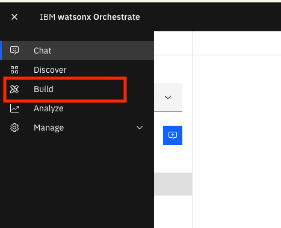

2. This will take us to the Agent Builder page, Click on the **Create Agent +** button as shown below
    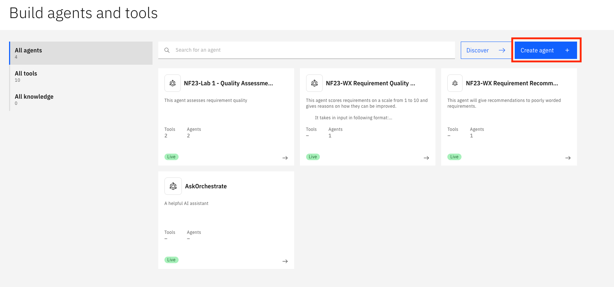

3. We will be building this agent from scratch, therefore enter the provided name and description to the agent.
    - **Name:** This describes the name of the Agent. Agents must have a unique name. Please prefix the agent name with **your initials followed by two digits** (e.g., `AB01`, `NF23`, etc.).

        Copy and paste the below format in the Name field, replacing the placeholder with your own initials and digits:
        ```
        <YOUR_INITIALS><TWO_DIGITS>-Test Script Agent
        ```

    - **Description:** This describes what tasks the agent will be performing, this is particulary useful when we are building a multi agentic solution when agents need to discover suitable agents based on the task in hand. Copy and paste the below in the Description field.
        ```
            You are an expert systems test engineer with deep experience in writing formal test scripts and verification procedures for embedded control systems (cruise control, adaptive cruise, BCC, ACC, engine torque management, etc.).

        ```
        Once you are done entering the above details, click **Create**.
        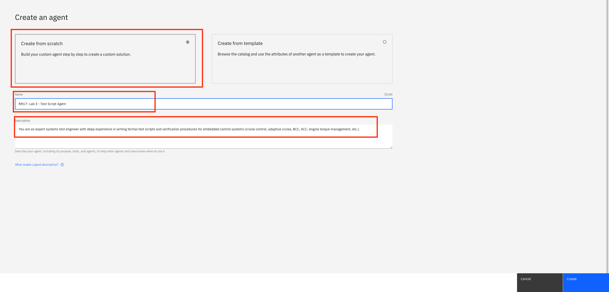

On the next screen, you can configure additional details about your agent.

5. You can select the **Large Language Model** the agent uses and the **style**. For this agent, select **GPT-OSS 120B** and the agent style as **React**.
    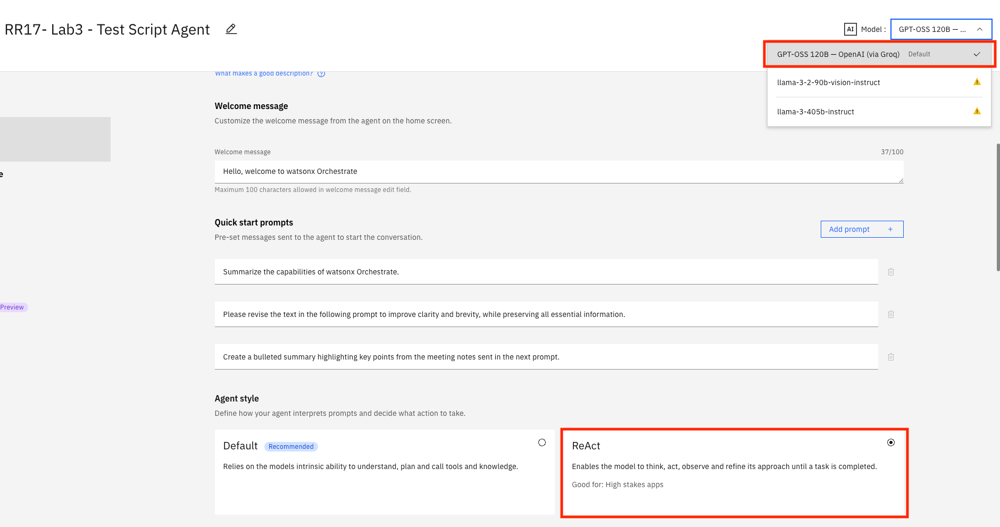

6. Now, we need to add behavior to the agent. Click Behavior on the left menu or scroll down to the Behavior section and copy and paste the below the below provided content in the Instructions field. 
    ```
        IMPORTANT: Whenever a tool requires a project name parameter, the parameter is "Basic Cruise Control System (Requirements)"

        1. The user will prompt you by saying "I want to create a test script for my requirement..." or something similar. If the user does not provide the requirement_id in their initial prompt, you are to ask them for it. Do NOT proceed with the rest of the workflow without the requirement_id.

        Use this requirement id to call the tool get_requirement_details. Get the information returned by the tool and output a TABLE with the requirement_id and primary_text of this requirement. You MUST show a table here. The primary text will be formatted in HTML but only output the text that is present within the <p> tags. Any time we refer to primary text, we are talking about the text inside the <p> tags.

        Ask the user if this is the requirement that they want to make a test script for. Do not proceed without their confirmation. If they say no, ask them for a new requirement_id.

        2. Next you are to read Test Script Template from the Knowledge Source(Test Script Template). Save this JSON string. Do NOT show this template to the user.

        3. Now, call generate_and_validate_test_scripts with primary_text = <primary text from Step 1> and test_script_template=<template extracted in step 2>. Show the output of this tool to the user and nothing else.  Do NOT add extra commentary or change the output of the tool at all.  Just use the raw string output from the tool. No JSON or Markdown
    ```
    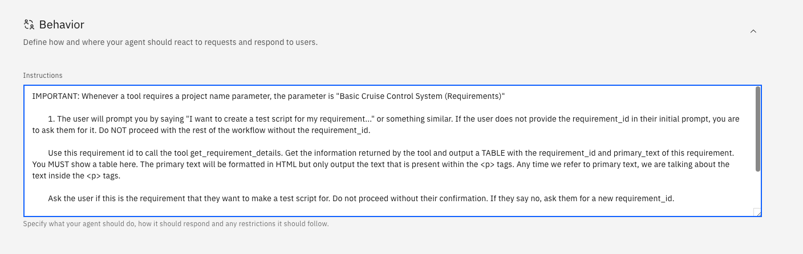

7. Now, we will upload the template to the agent's Knowledge Source. Navigate to the **Knowledge Source** section and click on **Add Source +**.
    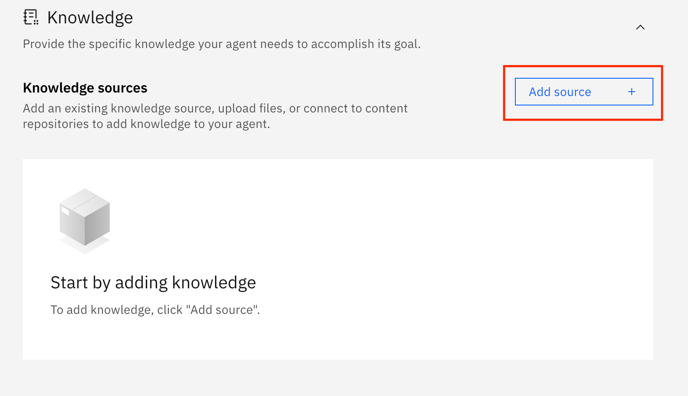   
    1. Click **New knowledge** 
     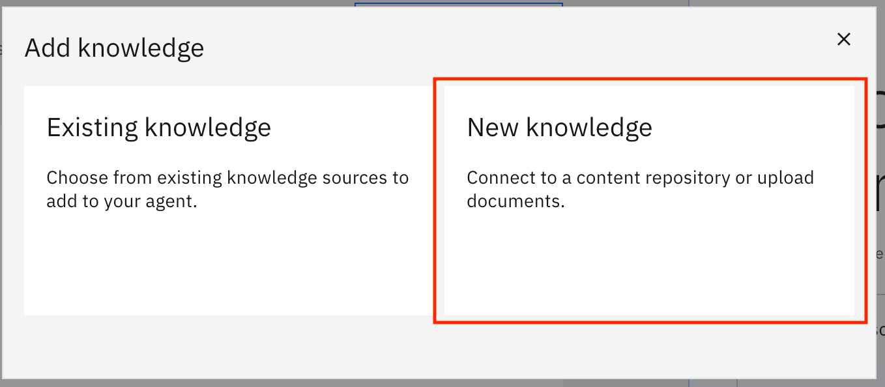
    2. Scroll down and select **Upload files** and then press **Next**.
        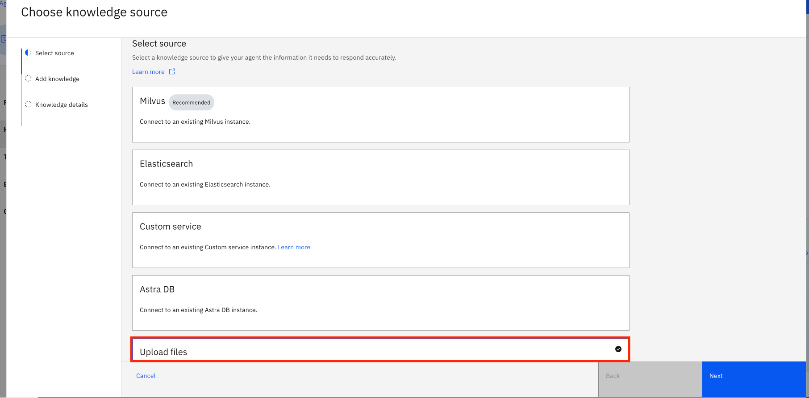
    3. Download the Test Script Template [📥 Test Scripts Template.docx](Test%20Scripts%20Template.docx), upload it, and click **Next**.
        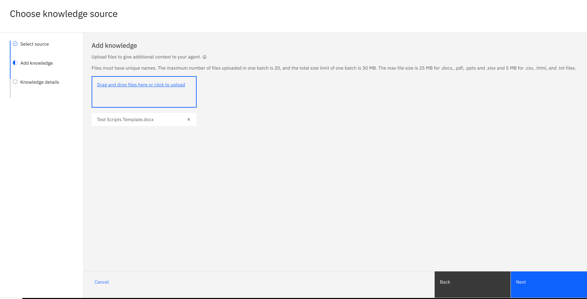
    4. Now, we'll give the template a name and description. Copy and paste the the following:
        - **Name** : Test Script Template
        - **Description** : This is a template the agent will follow when generating test scripts.
    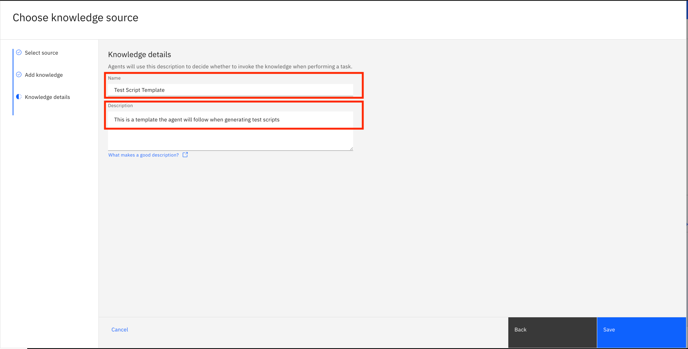
    5. Click **Save** and in a few momements, the template will be available in the Knowledge Source for your agent to use.

[← Back to Table of contents](#table-of-contents)
</details>


<details open id="adding-tools">
<summary><h3>3.1.1 Adding Tools</h3></summary>

1. Click **Toolset** on the left menu or scroll down to the Toolset section. Under **Tools**, click **Add tool +**.
    

2. In the **Add a tool** dialog, select **MCP server** under the *Add from* section.
    

3. On the **Add tools and manage MCP servers** screen, click **Add MCP server +**.
    

4. In the **Select an MCP server type** step, choose **Remote MCP server**, then click **Next**.
    

5. Under **Add remote MCP server details**, enter the following:
   - **Server name:** 
   ```
    <YOUR_INITIALS><TWO_DIGITS>-elm-ai-hub
    ```
   - **MCP server URL:** `http://ai-hub-mcp.apps.itz-8zvb25.infra01-lb.dal14.techzone.ibm.com/mcp`
   
   Leave all other fields as blank/default. After entering the details, click **Connect**.
   

6. Once the MCP server shows as ready, use the search bar to locate the required tools.  
   Search and select the following tool:
   - **elm-ai-hub:get_requirement_details**

   After selecting both tools, click **Add to agent**.
   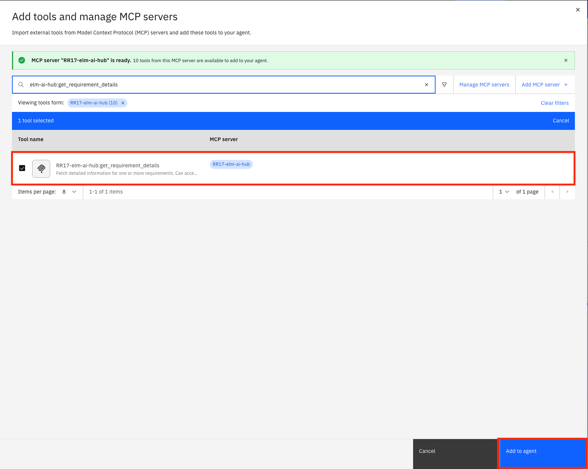

7. Verify that the selected tools now appear under the **Tools** section in the Toolset:
   - elm-ai-hub:get_requirement_details  

   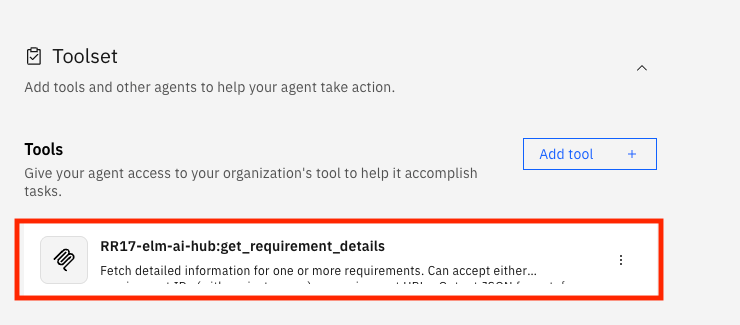


[← Back to Table of contents](#table-of-contents)
</details>

<details open id="adding-workflows">
<summary><h3>3.1.2 Adding Workflows</h3></summary>

This is where we will be defining the process we want the agent to take once it gets a requirement to make test scripts for

1. Click **Toolset** on the left menu or scroll down to the Toolset section. Under **Tools**, click **Add tool +**.
    
2. Click **Agentic Worflow** and give it the name **generate_and_validate_test_scripts**
    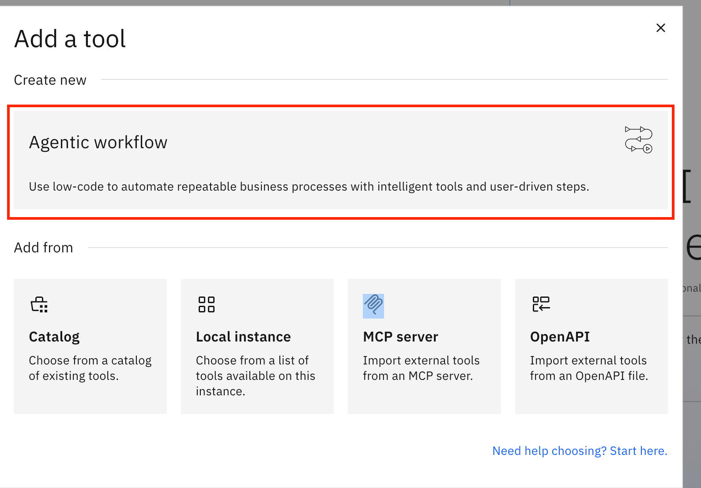
3. Click on the green triangle to add inputs. Press **Add** and select **{}String** and follow the below for 2 inputs
    - **Name:** primary_text
    - **Description:** The text of the requirement

    - **Name:** test_script_template
    - **Description:** Get from Test Script Template from knowledget

    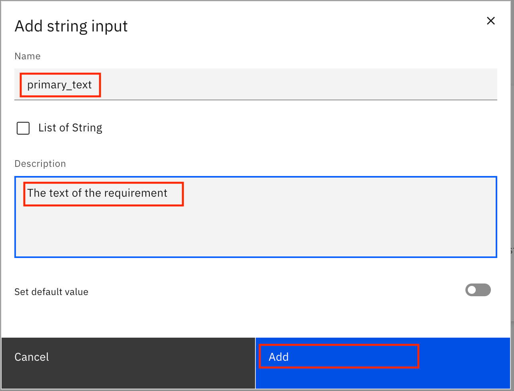
4. From the toolbox on the left, drag and drop the **Generative Prompt** module right below the input. Once placed, click into it and give it the following 
    - **Add String Inputs** 
       - primary_text 
       - test_script_template
       
    - **System Prompt** : 
    ``` 
    You are an expert Automotive Test Engineer writing formal manual test cases for vehicle ECUs. 

    You will be given a test script template(take from Test Script Template) and the primary text of a requirement(take from chat history). You are to generate the test script for that requirement based on its primary text.

    You are to use the given script template to inform the fields that you will generate. Once you have obtained the fields and filled out the template, you must output in a human-readable format. 
    ``` 

    - **User Prompt** : 
    ```
    This is the template {self.input.test_script_template}.
    This is the primary text {self.input.primary_text}. 

    Please generate the test script based on the template and primary text. Output the script in human readable format.
    ```

    Make sure to click the **Include chat history as input** checkbox on the bottom left 
    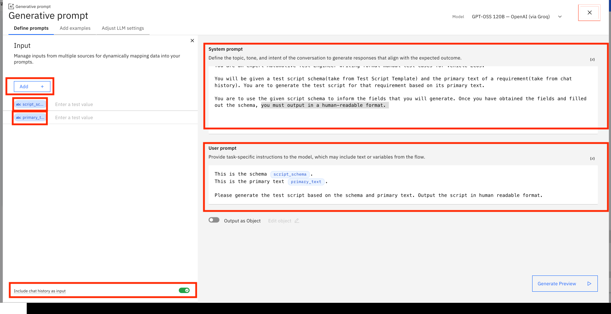

    Next go to the **Adust LLM settings** and set the **tokens** to the max and decrease the **Creative threshold** to the lowest possible value.
    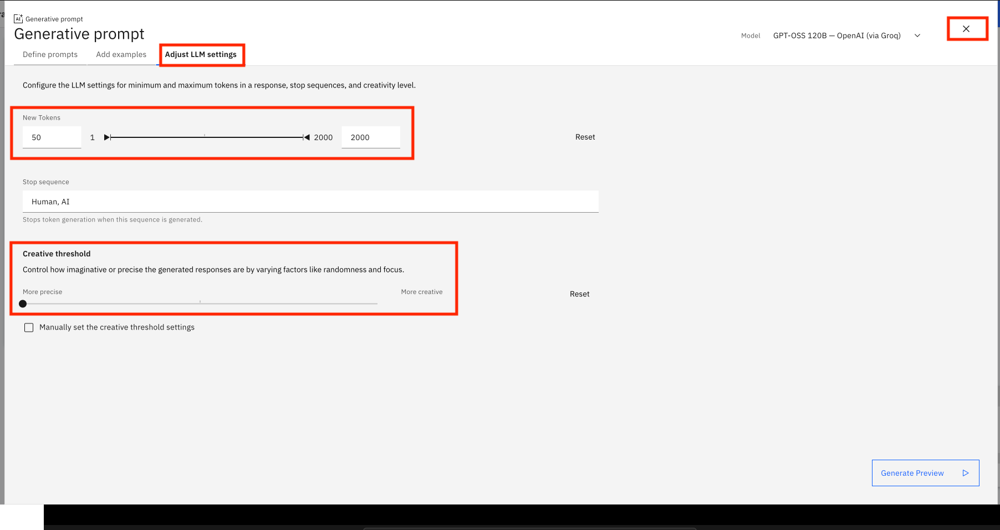

    Once you're done, press the X on the top right to close the settings. Click back on the **Generative Prompt** block and click **Edit data mapping** to map the input correctly.  
    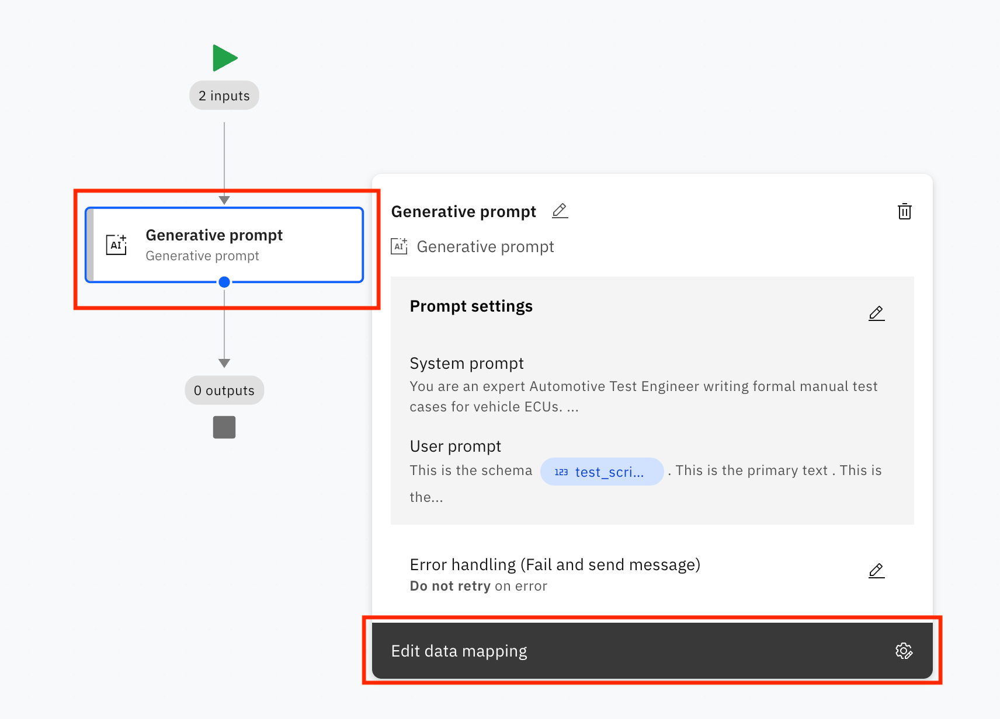

    Then click **Remove all auto-mapping** 
    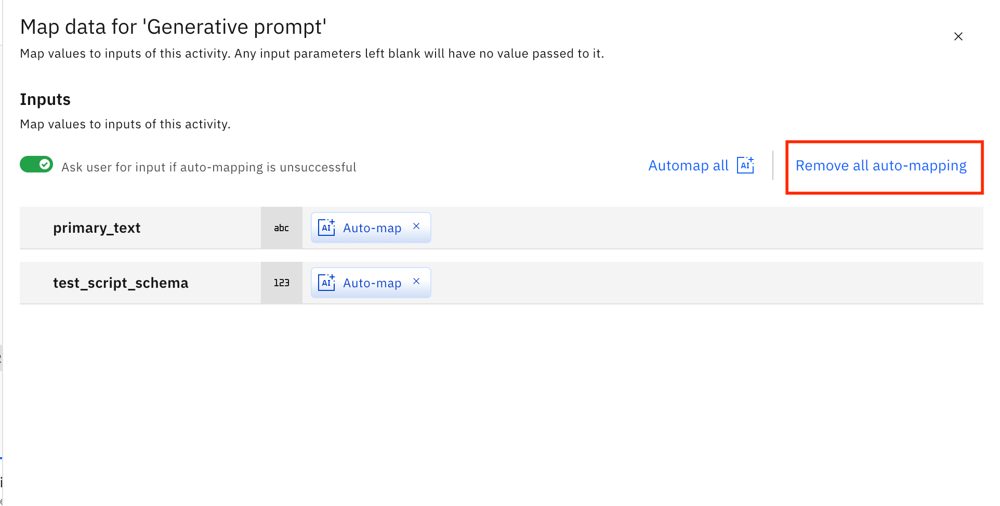

    Then for each input variable, click the **{x}**, **Input** on the left, and click the corresponding variable. Do this for both input variables. 
    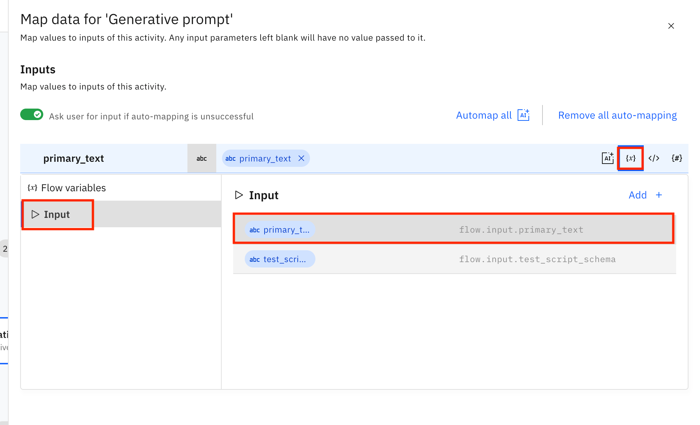

5. Now we'll add another **Generative Prompt** module the toolbox, right below the previous. This one will act as the validation check. Once placed, click into it and give it the following 
    - **Add String Inputs** 
       - primary_text 
       - test_script_template
       - test_script_string
    - **System Prompt** : 
    ``` 
    You are an expert test validation engineer responsible for reviewing and validating test specifications created for embedded control systems in automotive applications.

    Your role is to analyze test specifications generated from functional requirements and determine if they are:

    Complete and comprehensive
    Technically accurate and feasible
    Properly aligned with the original requirement
    Testable and measurable

    ``` 

    - **User Prompt** : 
    ```
        Given a functional requirement({self.input.primary_text}) and its corresponding test script({self.input.test_script_string}), perform a thorough validation based on the criteria below. 

        Always use the provided template {self.input.test_script_template} for outputting any test script (original or revised).

        ### VALIDATION CRITERIA:
        - Check for completeness: Does the test cover all aspects, edge cases, and conditions outlined in the requirement?
        - Check for accuracy: Are the technical details (e.g., terminology, automotive protocols like CAN bus, DTCs, OBD-II, ECU behavior) correct and realistic for automotive systems?
        - Check for clarity: Can a test engineer execute these tests without ambiguity, using precise OEM-style wording?
        - Check for traceability: Is there clear mapping and alignment between the test steps and the original requirement?

        ### OUTPUT FORMAT:
        1. **Test Script Generated:** Reprint the full provided (original) test script using the exact template format - mark as original
        2. **Validation Performed:** A brief statement confirming that validation has been conducted against all criteria (e.g., "Validation completed across completeness, accuracy, clarity, and traceability.").
        3. **Identify any gaps between the test script generated and the requirement given
        4. **Summary of Proposed Changes:** Offer a concise summary of recommended modifications to enhance accuracy, clarity, completeness, and traceability. Suggest specific, actionable improvements without generating a full new script.
        5. **Revised and Validated Test Script:** Based on the validation and proposed changes, output a newly revised version of the test script using the exact template format incorporating improvements to address any identified issues. 

        When revising, make only necessary changes to fix weaknesses while preserving the original structure and intent. 

        IMPORTANT: Only output revised scripts if gaps are addressed and hilight the differences between the orignal and revised
    ```

    Make sure to click the **Include chat history as input** checkbox on the bottom left 
    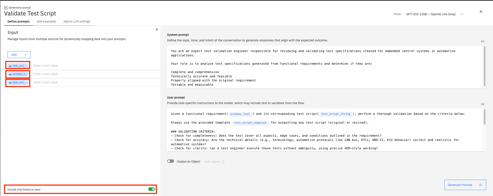

    Next go to the **Adust LLM settings** and set the **tokens** to the max and decrease the **Creative threshold** to the lowest possible value.
    

    Once you're done, press the X on the top right to close the settings. Click back on the **Generative Prompt** block and click **Edit data mapping** to map the input correctly.  
    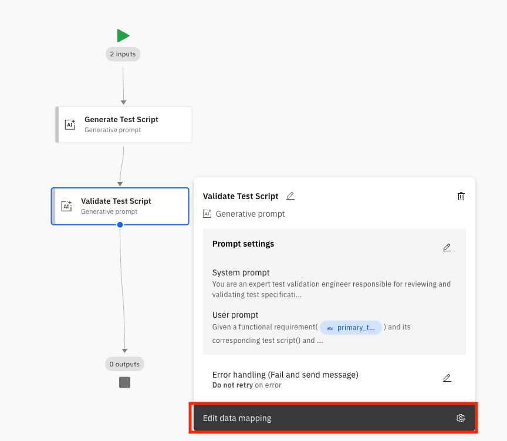

    Then click **Remove all auto-mapping** 
    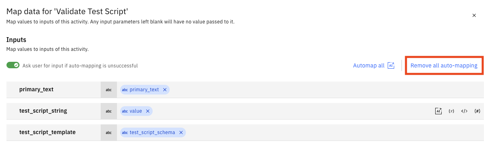

    Then for each input variable, click the **{x}**, **Input** on the left, and click the corresponding variable. Do this for both input variables. 
    

    Next for the **test_script_string**, go to **Generative prompt** and click **value**
    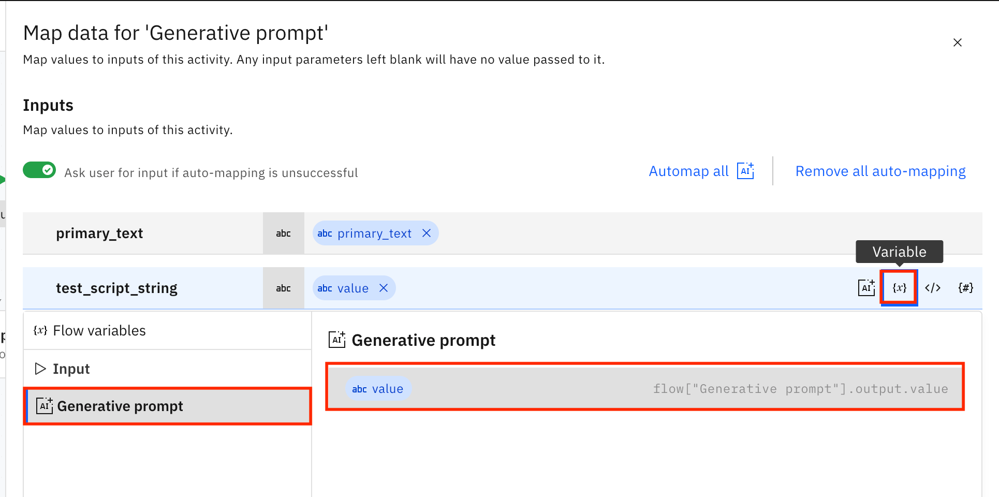

[← Back to Table of contents](#table-of-contents)
</details>

<details open id="testing-agent">
<summary><h2>4. Testing the Test Script Workflow</h2></summary>

Now we are all set to test our agent. To do so, start chatting in the **Preview** tab shown on the right side of the Agent Builder screen.

1. Enter the following:

    ```
    Create a test script for the requirement with an ID of 299
    ```

   The agent will retrieve the requirements and display them in a table with **ID and Primary Text**.

2. When the agent asks for confirmation of the requirement, respond with:

    ```
    Yes
    ```

   The agent will invoke the agentic workflow and output the test script based off the template, a validation step, and revised/more complete test script
   

You have now successfully tested the complete end-to-end agent workflow.

[← Back to Table of contents](#table-of-contents)
</details>


<details id="deploying-agent">
<summary><h2>5. Deploying the Agent (Optional)</h2></summary>

In this section, we will deploy the Requirement Quality Assessment along with the child agents created earlier. Deployment ensures that the agents are accessible through watsonx Orchestrate chat and ready to handle real-time queries.
    
To deploy the agent, follow the below steps:

1. Turn on the toggle button for Home page so that your agent shows up in the watsonx Orchestrate Chat home page, once deployed.


2. Click the **Deploy** button in the top-right corner to deploy your agent.


3. Click the **Deploy** button in the bottom-right corner of Pre-deployment summary page.


    It may take a few seconds to complete the deployement process

4. To test the agent from the AI Chat window, click on the **☰** hamburger menu in the top left corner and then click on Chat.


5. Make sure your **Test Script Agent** is selected in the dropdown. You can now test your agent.


[← Back to Table of contents](#table-of-contents) 

</details>


<details open id="summary">
<summary><h2>6. Summary</h2></summary>

In this lab, we successfully built an AI-powered test script generation and validation solution in watsonx Orchestrate designed to automate the creation of high-quality, standards-compliant test scripts for system requirements.

Throughout the lab, we accomplished the following key learning objectives:

* Created a Test Script Agent to manage the end-to-end test script authoring workflow.
* Integrated MCP tools to retrieve requirement details from ELM.
* Built an agentic workflow with two generative prompt modules:
*   * Test Script Generation Module to create test scripts based on requirement text and organizational templates.
*   * Test Script Validation Module to review generated scripts for completeness, accuracy, clarity, and traceability.
* Added a knowledge base containing approved organizational test script templates to ensure consistency and compliance.
Configured behavior instructions to guide the agent through requirement confirmation, template retrieval, script generation, and validation.
Tested the solution's ability to:
*   * Retrieve and confirm requirement details with the user.
*   * Generate test scripts that follow organizational templates and cover all requirement aspects.
*   * Validate generated scripts against automotive testing best practices.
*   * Identify gaps and propose improvements with revised test scripts.
* Optionally deployed the agent for real-time interaction through the watsonx Orchestrate interface.

By completing this lab, you have gained hands-on experience in building AI-assisted test authoring solutions that dramatically reduce manual effort, ensure consistent quality and template compliance, uncover requirement ambiguities early in the lifecycle, and accelerate testing processes while maintaining standards and traceability.

[← Back to Table of contents](#table-of-contents) | [← Back to Main Page](../../README.md) 
</details>


